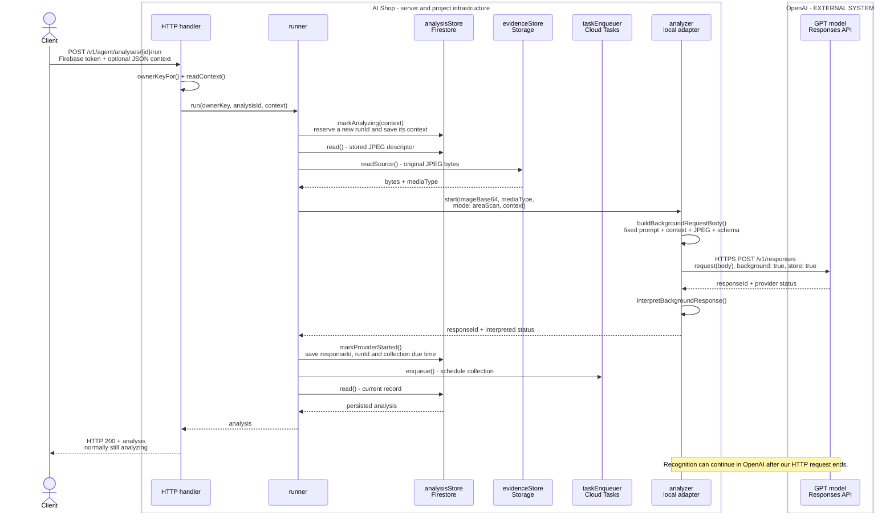
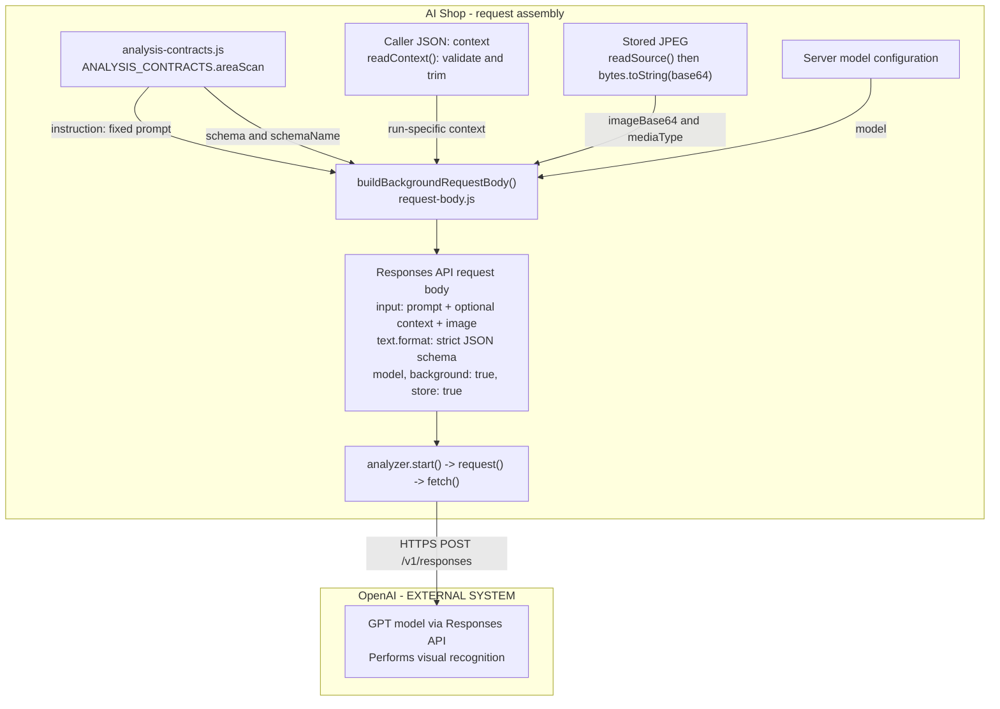
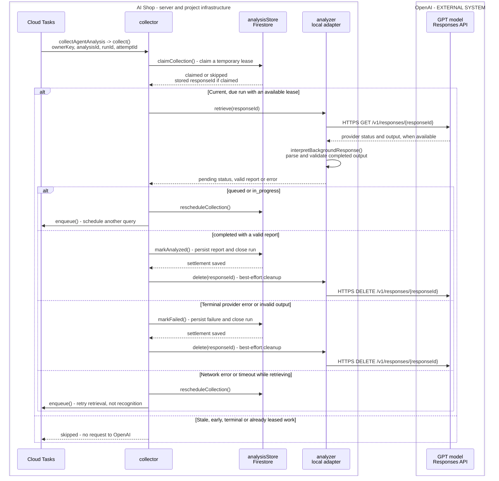

# From a stored photograph to a recognition report

Low-level design of `POST /v1/agent/analyses/{id}/run` for an already-stored JPEG.
This document connects the system boundary, execution sequence and request data
to the functions that implement them. Upload, video preparation and UI are outside this view.

## Purpose and system boundary

AI Shop turns a stored photograph into a durable report that remains available
after the caller closes the browser. `/run` starts recognition; a later server
invocation retrieves and saves the result. A GET only reads persisted state.

**GPT is an external model hosted by OpenAI. It does not run inside AI Shop.**
Our `analyzer` object is a local adapter: it prepares requests, calls the external
OpenAI Responses API over HTTPS and validates returned data. GPT performs the
visual recognition; AI Shop owns authorization, orchestration and persistence.

In the diagrams, the **AI Shop** box includes our server code and our Google Cloud
project's Firestore, Storage and Cloud Tasks. The **OpenAI — EXTERNAL SYSTEM** box
is a separate service. The caller has no direct connection to GPT in this flow.
Store/queue method names denote our adapters over those managed services.

## 1. Accept the request and start recognition

This is the normal start path. The separate request-assembly view in section 2
expands what happens inside `buildBackgroundRequestBody()`.

The `responseId` identifies OpenAI's background response, not our analysis record.
AI Shop stores that reference before dispatching collection. HTTP 200 means the
start request succeeded; it does **not** mean the report is ready.

## 2. Where the prompt and context enter the GPT request

The **fixed prompt** comes from source code. The **context** is a short instruction
supplied by the caller for this particular run, for example:
`{"context":"Count only the lower shelf."}`.
They are separate inputs; context is appended rather than replacing the fixed prompt.

| Input | Source in our code | Position in the external request |
| --- | --- | --- |
| Fixed recognition prompt | [ANALYSIS_CONTRACTS.areaScan — server/src/analysis-contracts.js:128](/Users/paboelustodo/-PROJECTS/aishop/server/src/analysis-contracts.js:128) | `input[0].content[0].text`, an `input_text` item containing `contract.instruction`. |
| Caller context | [readContext() — server/src/agent/api/run-context.js:7](/Users/paboelustodo/-PROJECTS/aishop/server/src/agent/api/run-context.js:7), passed through handler and runner | Optional second `input_text`, prefixed with `Additional instruction from the person requesting this analysis: `. |
| Original photograph | [readSource() — server/src/agent-evidence-store.js:142](/Users/paboelustodo/-PROJECTS/aishop/server/src/agent-evidence-store.js:142) | Final `input_image` item: a Base64 data URL, with `detail: auto`. |
| Output contract | Same `areaScan` contract | `text.format`: `json_schema`, `name`, `strict: true` and `schema`. |
| GPT model selection | [createFirebaseAgentHandler() — server/src/firebase-agent-handler.js:24](/Users/paboelustodo/-PROJECTS/aishop/server/src/firebase-agent-handler.js:24) and [createOpenAIBackgroundAnalyzer() — server/src/openai-analyzer.js:214](/Users/paboelustodo/-PROJECTS/aishop/server/src/openai-analyzer.js:214) | Top-level `model`; chosen by server configuration, not by this endpoint's caller. |

The precise assembly point is
[buildBackgroundRequestBody() — server/src/recognition/background/request-body.js:5](/Users/paboelustodo/-PROJECTS/aishop/server/src/recognition/background/request-body.js:5).
The actual HTTPS transport remains in
[request() — server/src/openai-analyzer.js:243](/Users/paboelustodo/-PROJECTS/aishop/server/src/openai-analyzer.js:243).

Important details of the current implementation:

- Prompt, optional context and image are content items inside **one `role: "user"` message**. The fixed prompt is not a separate API `system` message.
- Empty context produces no additional text item. The HTTP reader limits the note to 500 characters and the JSON body to 8 KiB.
- Context is saved with its run. A refinement sends the original JPEG and the new note, **not** the previous report or a conversation history.
- The runner selects `areaScan` for photographs: count visible front-facing units, separate uncertain items, and do not invent hidden stock. This path does not run YOLO or restrict recognition to the catalog.
- The external request contains the image, instructions, schema and model settings—not the caller's Firebase token. The adapter authenticates separately to OpenAI with the server credential.

## 3. Retrieve, validate and persist the result

This is a later invocation, triggered by Cloud Tasks—not a continuation that
requires the original HTTP connection to remain open. `collectAgentAnalysis`
validates the task envelope and invokes `collector.collect()`.

The adapter validates the **format and allowed values** of GPT's report; it does
not independently verify whether the product names or counts are visually correct.
Cleanup happens only after durable settlement. A cleanup failure does not erase
the stored report; a settlement failure must not discard the external response.

To read the result, the caller sends `GET /v1/agent/analyses/{id}`. The HTTP handler
authenticates the caller and uses `analysisStore.read()`; it does **not** call GPT,
collect a pending response or initiate recognition. The caller never reads
Firestore directly through this API contract.

## 4. Follow the design into the implementation

| Responsibility | Function and file |
| --- | --- |
| Accept `/run` and pass the validated context | [run() — server/src/agent-api-handler.js:398](/Users/paboelustodo/-PROJECTS/aishop/server/src/agent-api-handler.js:398) |
| Reserve, read the photograph, start GPT and schedule collection | [run() — server/src/agent/analysis/agent-analysis-runner.js:110](/Users/paboelustodo/-PROJECTS/aishop/server/src/agent/analysis/agent-analysis-runner.js:110) |
| Assemble the request and call the external provider | [start() — server/src/openai-analyzer.js:305](/Users/paboelustodo/-PROJECTS/aishop/server/src/openai-analyzer.js:305) |
| Interpret provider state and validate the report | [interpretBackgroundResponse() — server/src/recognition/background/response-interpreter.js:6](/Users/paboelustodo/-PROJECTS/aishop/server/src/recognition/background/response-interpreter.js:6) |
| Retrieve and durably settle the result | [collect() — server/src/agent/analysis/agent-analysis-collector.js:55](/Users/paboelustodo/-PROJECTS/aishop/server/src/agent/analysis/agent-analysis-collector.js:55) |

For every intermediate store/queue call, follow the [complete function map](analysis-run-functions.md).
Supporting guides cover [recognition details](photo-recognition.md),
[state, identities and error handling](photo-state-and-errors.md) and
[individual curl exercises](photo-curl-exercises.md).

The diagrams show normal coordination and collection outcomes, not every exception.
An ambiguous start may remain `analyzing`; blindly issuing another POST could buy
duplicate recognition. A queue failure can be repaired by the reconciler only
when the provider reference was saved. See the state/error guide for these limits.

This describes the local implementation, not a deployment or recognition-quality
claim. Local integration tests emulate Google Cloud services and simulate the
OpenAI and task-dispatch boundaries; [test evidence](../../10-review-and-release/sprint-015-agent-photo-run/README.md)
records what was actually exercised.
