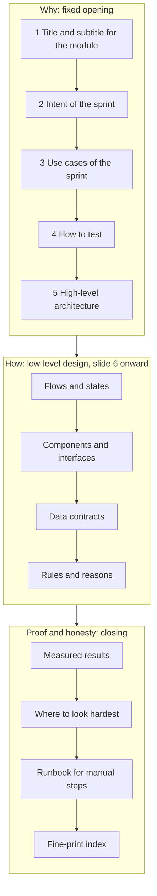

# Anatomy of a walkthrough

## Why first, then how, then proof

```mermaid
%%{init: {"themeVariables": {"fontSize": "20px"}, "flowchart": {"nodeSpacing": 35, "rankSpacing": 50}}}%%
flowchart TB
    subgraph WHY[Why: fixed opening]
        direction TB
        A[1 Title and subtitle for the module] --> B[2 Intent of the sprint]
        B --> C[3 Use cases of the sprint]
        C --> D[4 How to test]
        D --> E[5 High-level architecture]
    end
    subgraph HOW[How: low-level design, slide 6 onward]
        direction TB
        F[Flows and states] --> G[Components and interfaces]
        G --> H[Data contracts]
        H --> I[Rules and reasons]
    end
    subgraph PROOF[Proof and honesty: closing]
        direction TB
        J[Measured results] --> K[Where to look hardest]
        K --> L[Runbook for manual steps]
        L --> M[Fine-print index]
    end
    WHY --> HOW
    HOW --> PROOF
```
