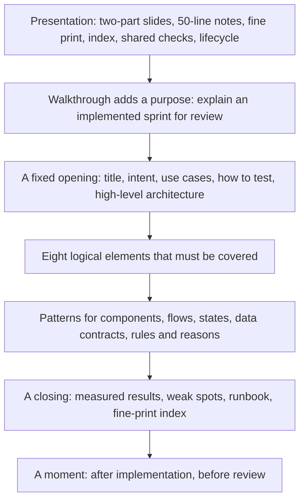

# A walkthrough is a presentation

## It inherits the form and adds a purpose

```mermaid
%%{init: {"themeVariables": {"fontSize": "20px"}, "flowchart": {"nodeSpacing": 35, "rankSpacing": 50, "wrappingWidth": 460}}}%%
flowchart TB
    P[Presentation: two-part slides, 50-line notes, fine print, index, shared checks, lifecycle] --> W[Walkthrough adds a purpose: explain an implemented sprint for review]
    W --> A[A fixed opening: title, intent, use cases, how to test, high-level architecture]
    A --> B[Eight logical elements that must be covered]
    B --> C[Patterns for components, flows, states, data contracts, rules and reasons]
    C --> D[A closing: measured results, weak spots, runbook, fine-print index]
    D --> E[A moment: after implementation, before review]
```
