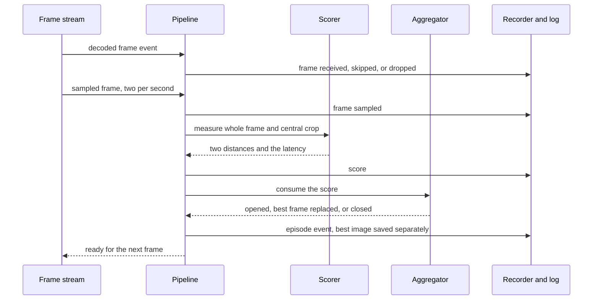

# Pattern: a flow

## Example: one sampled frame, from decode to log

Time runs top to bottom; a sequence diagram places its participants side by side.

```mermaid
%%{init: {"themeVariables": {"fontSize": "18px"}, "sequence": {"actorFontSize": 18, "messageFontSize": 18, "noteFontSize": 18, "width": 170}}}%%
sequenceDiagram
    participant S as Frame stream
    participant P as Pipeline
    participant C as Scorer
    participant A as Aggregator
    participant L as Recorder and log
    S->>P: decoded frame event
    P->>L: frame received, skipped, or dropped
    S->>P: sampled frame, two per second
    P->>L: frame sampled
    P->>C: measure whole frame and central crop
    C-->>P: two distances and the latency
    P->>L: score
    P->>A: consume the score
    A-->>P: opened, best frame replaced, or closed
    P->>L: episode event, best image saved separately
    P-->>S: ready for the next frame
```
