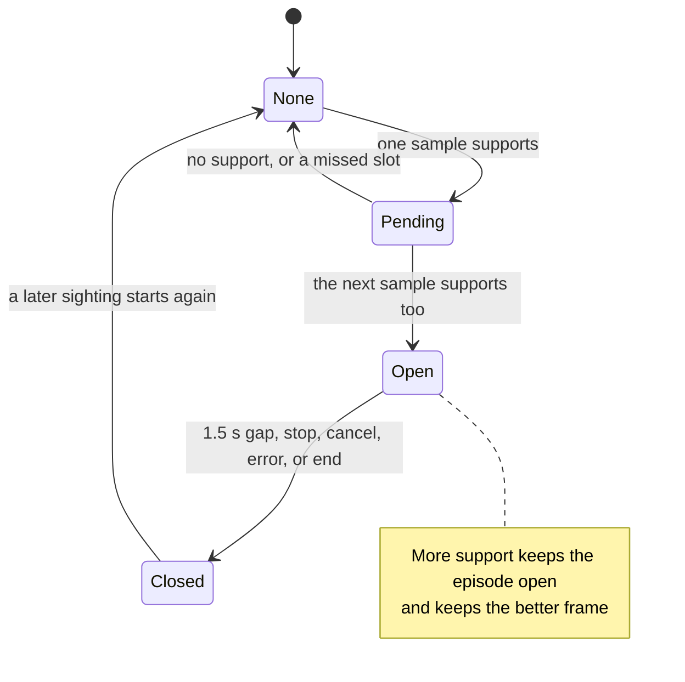

# Pattern: a state diagram

## Example: the life of a candidate episode

```mermaid
stateDiagram-v2
    direction TB
    [*] --> None
    None --> Pending: one sample supports
    Pending --> None: no support, or a missed slot
    Pending --> Open: the next sample supports too
    Open --> Closed: 1.5 s gap, stop, cancel, error, or end
    Closed --> None: a later sighting starts again
    note right of Open
        More support keeps the episode open
        and keeps the better frame
    end note
```
