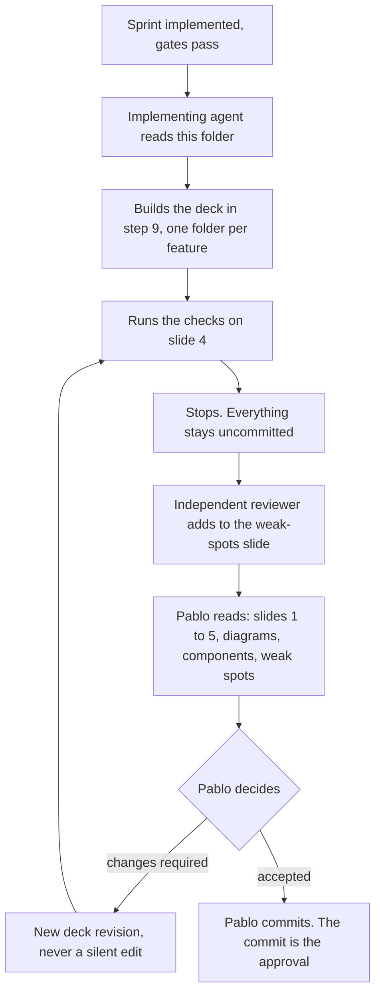

# When and how a walkthrough is made

## After implementation, before review

```mermaid
%%{init: {"themeVariables": {"fontSize": "20px"}, "flowchart": {"nodeSpacing": 35, "rankSpacing": 50}}}%%
flowchart TB
    A[Sprint implemented, gates pass] --> B[Implementing agent reads this folder]
    B --> C[Builds the deck in step 9, one folder per feature]
    C --> D[Runs the checks on slide 4]
    D --> E[Stops. Everything stays uncommitted]
    E --> F[Independent reviewer adds to the weak-spots slide]
    F --> G[Pablo reads: slides 1 to 5, diagrams, components, weak spots]
    G --> H{Pablo decides}
    H -- changes required --> I[New deck revision, never a silent edit]
    I --> D
    H -- accepted --> J[Pablo commits. The commit is the approval]
```
