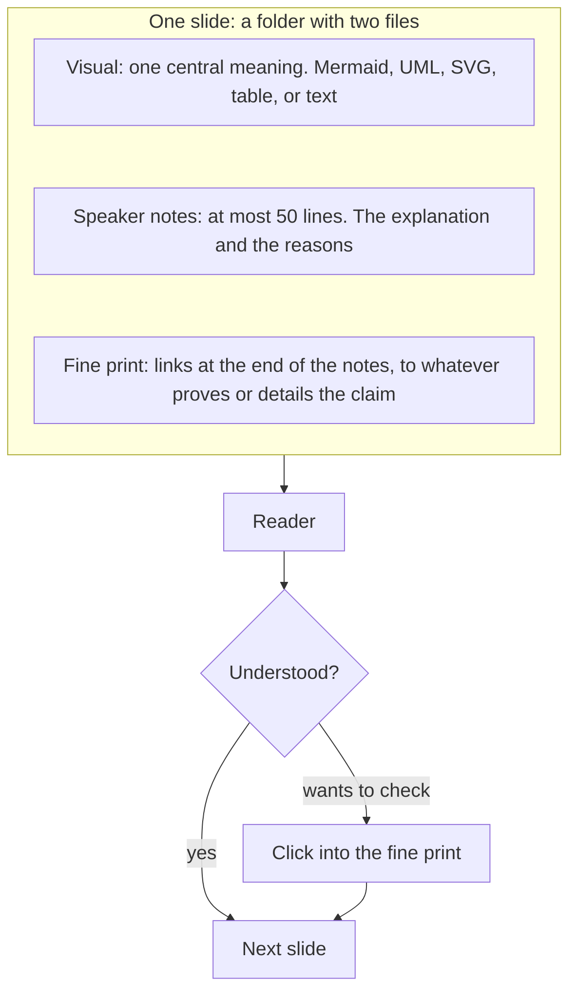

# The slide unit

## One visual, one set of notes, fine print at the end

```mermaid
%%{init: {"themeVariables": {"fontSize": "20px"}, "flowchart": {"nodeSpacing": 35, "rankSpacing": 40, "wrappingWidth": 460}}}%%
flowchart TB
    subgraph S[One slide: a folder with two files]
        direction TB
        V[Visual: one central meaning. Mermaid, UML, SVG, table, or text]
        N[Speaker notes: at most 50 lines. The explanation and the reasons]
        F[Fine print: links at the end of the notes, to whatever proves or details the claim]
        V ~~~ N ~~~ F
    end
    S --> R[Reader]
    R --> Q{Understood?}
    Q -- yes --> X[Next slide]
    Q -- wants to check --> C[Click into the fine print]
    C --> X
```
