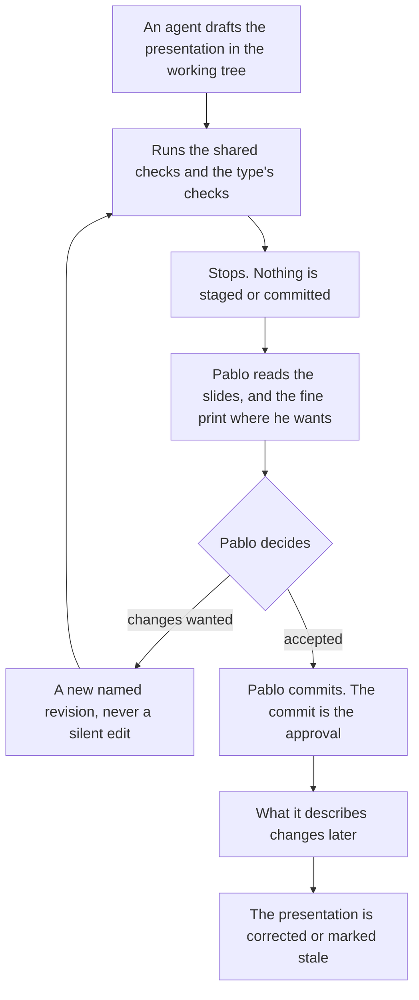

# Lifecycle of a presentation

## Draft, check, stop, review, revise, commit

```mermaid
%%{init: {"themeVariables": {"fontSize": "20px"}, "flowchart": {"nodeSpacing": 35, "rankSpacing": 50}}}%%
flowchart TB
    A[An agent drafts the presentation in the working tree] --> B[Runs the shared checks and the type's checks]
    B --> C[Stops. Nothing is staged or committed]
    C --> D[Pablo reads the slides, and the fine print where he wants]
    D --> E{Pablo decides}
    E -- changes wanted --> F[A new named revision, never a silent edit]
    F --> B
    E -- accepted --> G[Pablo commits. The commit is the approval]
    G --> H[What it describes changes later]
    H --> I[The presentation is corrected or marked stale]
```
