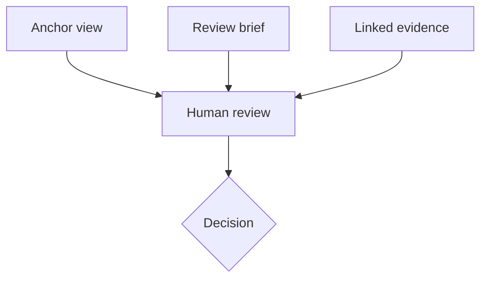

AI-MODIFIED - 2026-09-20T18:06Z

# Reviewability — Governance Proposal

Status: PROPOSAL. This rule is not active until the human reviewer commits it.
## Principle
Human attention is a constrained system resource. Agent-generated work must
optimize not only for truth and logical correctness, but also for reviewability.
An important artifact should be understandable with reasonable effort and,
where practical, be a pleasure rather than a burden for the human in the loop.
## The HITL review unit
For a significant decision or change, prefer one review unit containing:
1. **Anchor view** — one diagram, table, mockup, image, or concise text slide
   that communicates the central meaning.
2. **Review brief** — at most 50 physical lines explaining the decision,
   reasoning, scope, consequences, risks, and questions for the reviewer.
3. **Linked evidence** — specifications, tests, logs, research, code, and
   appendices. Evidence is not compressed merely to satisfy the line budget.
The model is: **slide + speaker notes + evidence**.

## Application

- Treat 50 lines as an attention budget, not an information limit.
- Prefer one decision per brief and one central meaning per anchor view.
- Link supporting detail instead of packing it into dense prose.
- Use Mermaid or UML for structure and behavior, tables for exact comparison,
  SVG or HTML for interface mockups, and generated images for conceptual views.
- Visuals clarify; they do not decorate or substitute for evidence.
- A text-only anchor is acceptable when it is the clearest representation.
- Apply the full review unit selectively where human judgment is material.

## Parallel work

Documentation may be prepared in parallel with implementation, but both must
share the same approved scope and identify the exact repository revision they
describe. A stale or mismatched review unit must be corrected before approval.

## Adoption question

After review, either commit this proposal and link it from the governance index,
revise it, or remove it. Committing this file records approval of its exact text;
it does not authorize implementation, deployment, merge, publication, or release.
