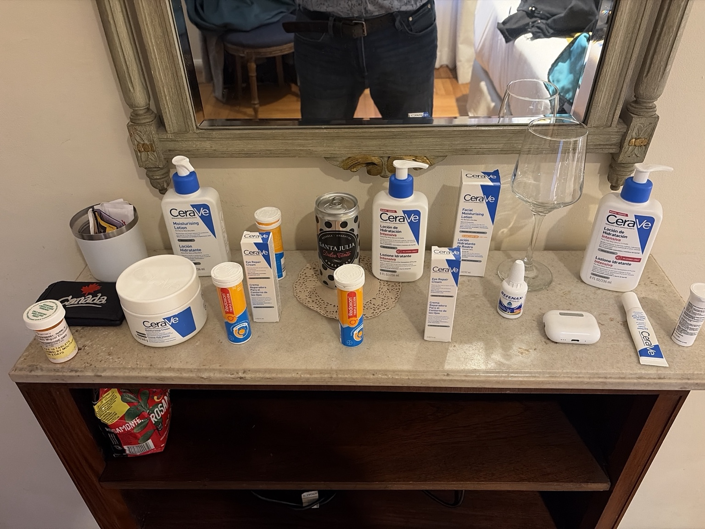

# Benchmark 05 — Tabletop Scene Counts

Experiment A of [benchmark 04](../../benchmark-04-zero-context-recognition-baseline.md).
20 tabletop objects, 15 product units, 8 CeraVe product units.

## Prompt, verbatim

> How many Objects do your see in this picture, how many are products
> from the brand cerave. ?
>
> If you find more than one ítem of the same type please count how many
> of the same type

## CeraVe products GPT identified

| Type | Count | Visible form |
| --- | --- | --- |
| Eye Repair Cream | 3 | Two retail cartons and one loose tube |
| Intensive Moisturizing Lotion, 236 mL | 2 | Pump bottles |
| Moisturising Lotion | 1 | Pump bottle |
| Moisturising Cream | 1 | Tub |
| Facial Moisturising Lotion SPF 30 | 1 | Retail carton |
| **Total** | **8** | |

## Other products GPT identified

| Type | Count | Visible form |
| --- | --- | --- |
| Redoxon Triple Acción | 3 | Effervescent-tablet tubes; one partly hidden |
| Prescription medicine | 1 | Pill bottle |
| Santa Julia Dulce Tinto | 1 | Can |
| Refenax | 1 | Drops bottle |
| Unidentified product | 1 | White cylindrical container at far right |
| **Total** | **7** | |

## Classified as non-products

Five objects: desktop organizer, black Canada zip pouch, stemmed glass,
wireless-earbud charging case, decorative lace doily.

## Counting scope

Distinct physical objects on the tabletop. Furniture, the lower shelf,
background objects and mirror reflections are excluded. Retail cartons
count once; unseen contents are not added. The loose CeraVe tube counts
separately. Organizer contents are not counted; the doily counts as one.
