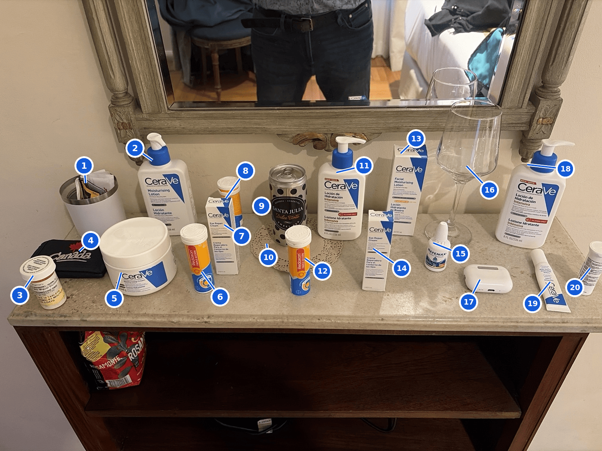

# Benchmark 06 — Tabletop Object Map

Experiment A of [benchmark 04](../../benchmark-04-zero-context-recognition-baseline.md).

GPT did more than count and classify: it localized each of the 20
tabletop objects with near-object-level precision, including duplicate
product instances and partially obscured items, and produced a numbered
overlay tying every identifier back to a position in the source image.

| ID | Identified object | Classification |
| --- | --- | --- |
| 1 | Desktop organizer | Non-product |
| 2 | CeraVe Moisturising Lotion (pump bottle) | CeraVe |
| 3 | Prescription medicine (pill bottle) | Other product |
| 4 | Black Canada zip pouch | Non-product |
| 5 | CeraVe Moisturising Cream (tub) | CeraVe |
| 6 | Redoxon Triple Acción tube | Other product |
| 7 | CeraVe Eye Repair Cream (retail carton) | CeraVe |
| 8 | Redoxon Triple Acción tube, partly hidden | Other product |
| 9 | Santa Julia Dulce Tinto can | Other product |
| 10 | Decorative lace doily | Non-product |
| 11 | CeraVe Intensive Moisturizing Lotion (pump bottle) | CeraVe |
| 12 | Redoxon Triple Acción tube | Other product |
| 13 | CeraVe Facial Moisturising Lotion SPF 30 (carton) | CeraVe |
| 14 | CeraVe Eye Repair Cream (retail carton) | CeraVe |
| 15 | Refenax drops bottle | Other product |
| 16 | Stemmed glass | Non-product |
| 17 | Wireless-earbud charging case | Non-product |
| 18 | CeraVe Intensive Moisturizing Lotion (pump bottle) | CeraVe |
| 19 | CeraVe Eye Repair Cream (loose tube) | CeraVe |
| 20 | Unidentified white cylindrical container | Other product |

## Why this matters for the agent

Localization is not something `areaScan` asks for or the report schema
can carry. The benchmark demonstrates a capability the current contract
does not request; whether to ask for it is an open product question.
