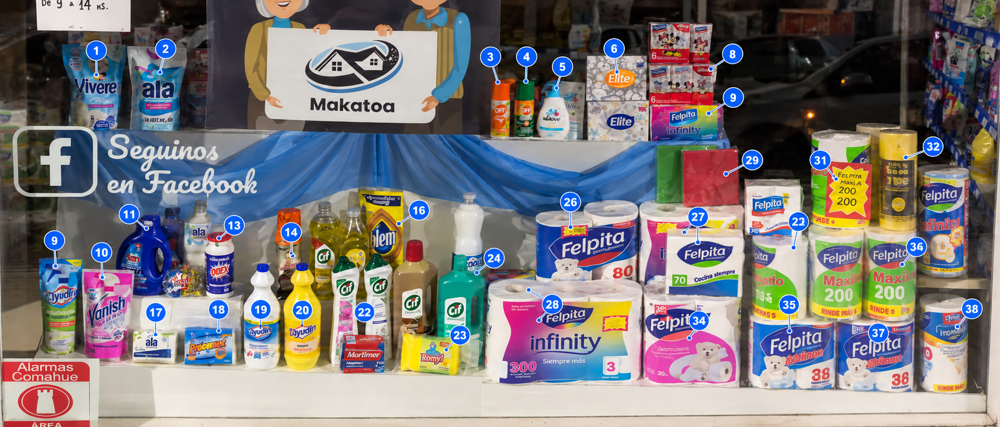

# Benchmark 08 — Video Scan, Care and Paper Goods

Continues [03](03-video-scan-cleaning.md).

## Insect protection and personal care

- V21 — OFF! lotion or cream bottle
- V22 — OFF! orange aerosol
- V23 — OFF! green aerosol
- V24 — Baby Dove pump bottle
- V25 — Baby Dove refill pouch

## Tissues, paper products and rolls

- V26 — Elite tissue boxes, at least two visible packaging designs
- V27 — Felpita Disney tissue boxes
- V28 — Felpita Infinity rainbow package
- V29 — Felpita Industrial 80-metre rolls
- V30 — Felpita Infinity 300, three-roll package
- V31 — Felpita Premium 30 package
- V32 — Felpita 70 "Calidad Superior"
- V33 — Felpita "Para cada día" 70
- V34 — Green and red coloured napkin packs
- V35 — Felpita Maxirollo 200
- V36 — Felpita Maxi 150
- V37 — Felpita Individuales 70
- V38 — Felpita Disney package
- V39 — Felpita multipacks marked "50"
- V40 — Yellow-and-black multipurpose cleaning roll, probably Joly

## Partially readable or unresolved

- U01 — Dark-blue detergent bottle; label not safely readable
- U02 — Orange aerosol behind the cleaning products
- U03 — Blue boxed cleaning-soap product
- U04 — Several hanging toothbrush or oral-care products
- U05 — Several hanging personal-care sachets
- U06 — Yellow cleaning-liquid bottle at the far right

## Interpretation and limits

Video gives stronger coverage than any single frame, because a product
hidden in one view may appear in another. But camera movement, glare,
low resolution and shifting occlusion prevent a defensible exact unit
count per line. The IDs are stable labels for findings, not shelf
coordinates or quantities. The panoramic reconstruction in the source
document is explanatory; the video is the observational record.
