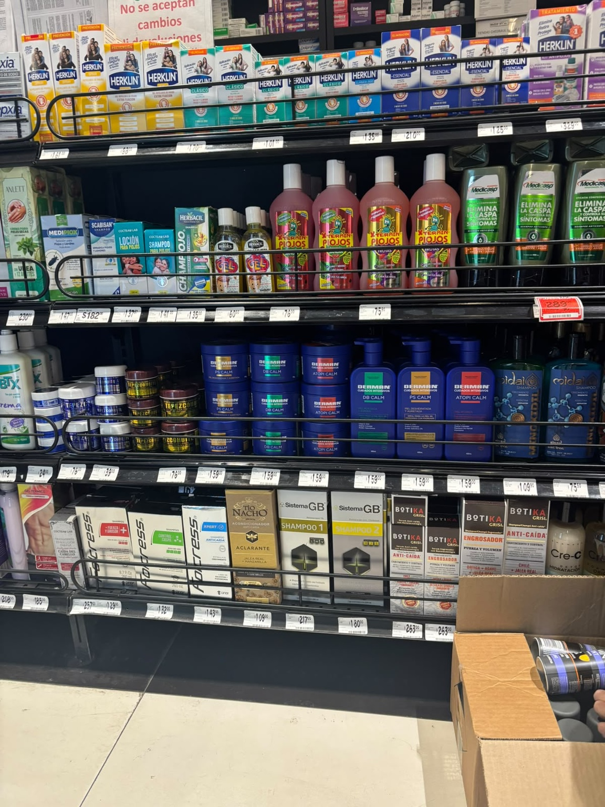

# Benchmark 09 — Dense Pharmacy Shelf, Summary

Experiment B of [benchmark 04](../../benchmark-04-zero-context-recognition-baseline.md).

## Result

From one dense photograph and a very short prompt, GPT separated the
scene into shelf regions, grouped repeated packaging, recognized brands
where labels were readable, counted packages, and mapped every finding
back to a position.

| Measure | Finding |
| --- | --- |
| Input | One 1152 × 1536 pharmacy-shelf image |
| Context supplied | None — no catalog, SKU list, planogram, feed, or boxes |
| Distinct reference groups | 42 product types or packaging variants |
| Visible physical items | 94, including partial/rear packages and five in an open carton |

## Prompt, verbatim — "same method" gave only the annotation convention

> Try this one now using the same method, identifique all products that
> you can, put a number on them, and write the list of products found

## Counting rules

- **Reference number.** One badge per distinct product group or clearly
  different packaging variant. It is a lookup key, not a claim that only
  one package exists.
- **Repeated product.** Identical packages share one number; their unit
  count goes in the quantity column. Two visibly different designs of
  one named product are separated when the difference is strong enough
  to affect image matching.
- **Inclusive visible unit.** Count a package when enough is visible to
  distinguish it as a separate object, partial rear and occluded ones
  included. Exclude price labels, rails, signs, cardboard, floor tiles,
  and stock outside the display plane.

## Shelf-level totals

| Region | IDs | Groups | Visible units |
| --- | --- | --- | --- |
| Upper display | 1–6 | 6 | 20 |
| Middle display | 7–16 | 10 | 21 |
| Lower display | 17–27 | 11 | 30 |
| Bottom display + carton | 28–42 | 15 | 23 |
| **Total** | 1–42 | **42** | **94** |

**94 is not a facing count.** A retail-facing metric counts only consumer-facing units on the active plane, and would be lower.
