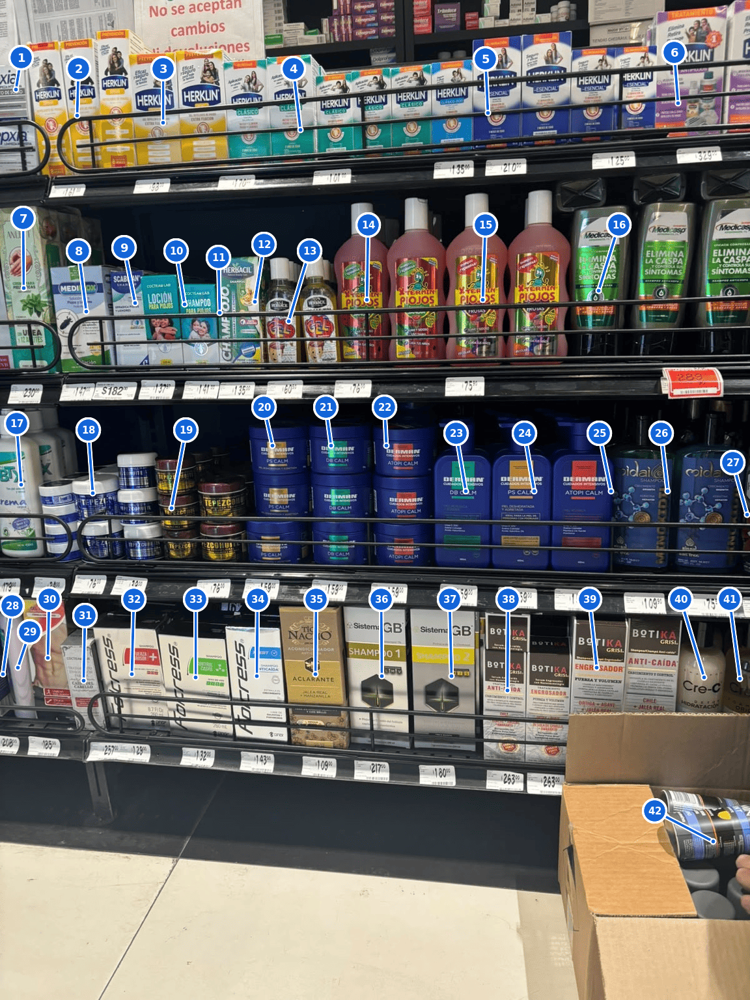

# Benchmark 10 — Dense Shelf Register, Upper and Middle

Register for [01](01-summary.md).

Confidence reflects what the photograph itself supports. **High** — the
brand and product line are clear. **Medium** — the family or use is
clear but an exact variant, size, or spelling is uncertain. **Low** — a
separate object is visible but its identity cannot be responsibly
established.

## Upper display

| ID | Identification | Qty | Confidence |
| --- | --- | --- | --- |
| 1 | Unidentified clipped cartons ending "…xia" | 2 | Low — narrow label fragment only |
| 2 | Herklin Spray Prevención, yellow | 3 | High — brand, format, variant clear |
| 3 | Herklin Gel Extra Fijación, yellow | 2 | High — wording and repeat visible |
| 4 | Herklin Clásico, turquoise | 6 | High — repeated line clearly grouped |
| 5 | Herklin Esencial, blue | 5 | High — repeated line clearly grouped |
| 6 | Herklin Kit Antipiojos, purple | 2 | High — kit design readable |

## Middle display

| ID | Identification | Qty | Confidence |
| --- | --- | --- | --- |
| 7 | Anlett Crema para Pieles Secas | 4 | Medium — one front, three partial rear |
| 8 | Medipiox solution for lice and nits | 1 | High — brand and use readable |
| 9 | Scabisan shampoo | 1 | High — brand and format readable |
| 10 | Coctelab Loción para Piojos | 1 | High — name and use readable |
| 11 | Coctelab Shampoo para Piojos | 1 | High — name and use readable |
| 12 | Herbacil Champiojo anti-lice shampoo | 1 | Medium — wording partly obscured |
| 13 | Herbacil anti-lice gel | 5 | High for family; two fronts, three rear |
| 14 | X-Termin Piojos, green/red label | 2 | High — first design visually distinct |
| 15 | X-Termin Piojos, red/gold label | 2 | High — second design visually distinct |
| 16 | Medicasp anti-dandruff shampoo | 3 | High — brand and claim readable |
