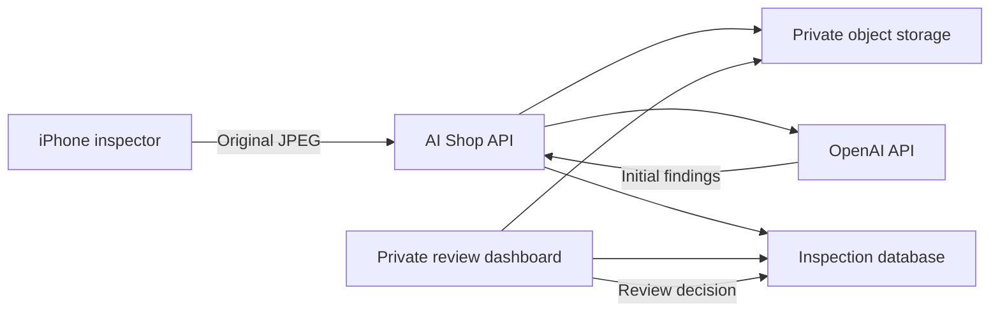

# Architecture 02 — Audit Storage and Human Review

HumanReviewerInitials: PME
## Purpose

Extend AI Shop with durable inspection evidence and a private human-review workflow.
## Flow

## Responsibilities

### iPhone app

Captures a JPEG, preserves the original bytes, identifies the scan mode and app version, uploads the evidence, and displays the initial report.
### AI Shop API

Authenticates the client, assigns a scan ID, hashes and stores the original image, requests AI analysis, and creates the inspection record.
### Object storage

Stores the full original image under a unique non-overwriting path. Dashboard scaling must not replace this object.

### Inspection database

Links image metadata, hash, scan mode, initial findings, status, and append-only human review information.

### Review dashboard

Requires reviewer authentication, displays pending and recent scans, shows the image and findings together, and records verification, correction, rejection, and notes.

## Audit rules

- Never overwrite the original image or initial AI findings.
- Use server timestamps for submission and review events.
- Keep human disposition separate and attributable.
- Treat AI results as unverified until a reviewer decides otherwise.
- Do not automatically delete audit evidence during this proof.

## Security boundary

The OpenAI credential remains server-side. Dashboard access requires stronger reviewer authentication than the shared proof-of-concept client token.
