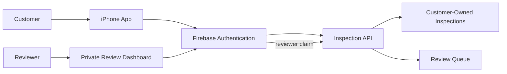

# AI Shop Customer and Reviewer Access

HumanReviewerInitials:PME

## Purpose

Separate public AI Shop customers from trusted human reviewers. These are distinct account classes, not successive privilege levels.

## Access model

| Account class | Enrollment | Permitted access |
| --- | --- | --- |
| Customer | Self-registration in the iPhone app, Google or Email/Password | Create inspections and view only their own pictures and results. |
| Reviewer | Administrator creates the account directly in Firebase | View the authorized review queue and record attributable review decisions. |

## Enforcement

- Firebase UID is the stable identity for both account classes.
- A customer submission records an immutable `ownerId` from a verified ID token; reads require `inspection.ownerId == authenticated.uid`.
- Reviewer operations require a verified token with `reviewer: true`.
- The backend enforces ownership and reviewer claims on every protected request; dashboard visibility never substitutes for that check.

## Experience boundaries

- Customers register with Google Sign-In or Email/Password, neither preferred, with no email verification or administrator step required.
- Email/Password customers use Firebase's standard reset-email flow.
- Reviewers cannot self-register; only an administrator grants access.
- Customer registration never grants access to another customer's data or the review queue.

## Status

Decided: customers get Google Sign-In and Email/Password, self-service; old shared-token submissions keep no owner; the reviewer path needs no new tooling. Gap: the app still shares one static client token instead of verified per-user identity — closing it is planned in [Sprint 004](../07-planning/sprints/sprint-004/01-sprint-plan.md), not built yet.

## Decisions still required

Customer deletion and retention, a private **My Inspections** view, and whether reviews become visible to the owning customer before production.
