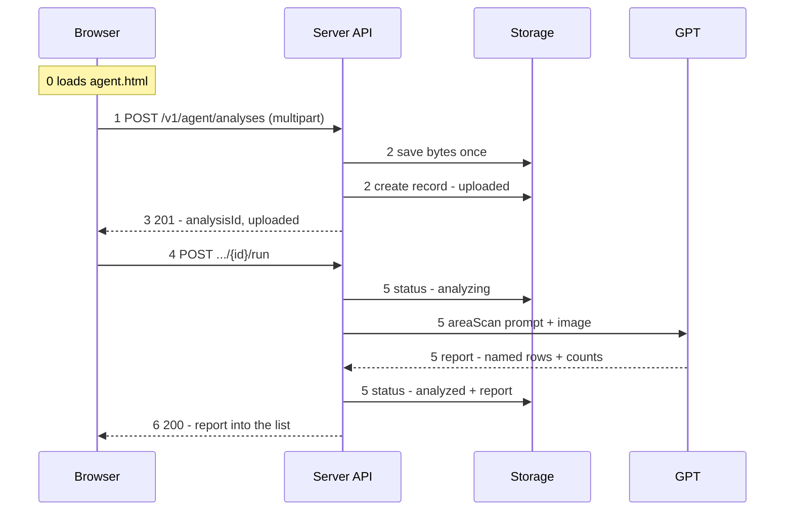

# AI Shop Agent Upload and Analysis Path

HumanReviewerInitials:

## Purpose

Describe the path a single photograph takes from the browser to a counted shelf, and name the file responsible at each step. This is the low-level design behind Sprint 008.

## Shape of the path

Upload and analysis are **two separate calls**. Everything up to the acknowledgement is durable and cheap; only the run spends money, and only after something has explicitly asked for it.

## Step 0 — The page loads

Firebase Hosting serves a static page. Its script signs in, then immediately fetches the existing analyses, so the page opens showing history rather than an empty box.

| State | File | Responsibility |
| --- | --- | --- |
| to build | `dashboard/agent.html` | the upload field, the submit button, the list |
| to build | `dashboard/scripts/agent.js` | sign-in, submit, and rendering the rows |

## Step 1 — A photograph is chosen and submitted

The script builds a `multipart/form-data` body with exactly one file part and sends it with the Firebase ID token. The file picker filters for JPEG, but that filter is a courtesy to the user, not a check — the server assumes the browser may be lying.

| State | File | Responsibility |
| --- | --- | --- |
| to build | `dashboard/scripts/agent.js` | builds and posts the body |

## Step 2 — The server takes the image and stores it

Five files in order. The request is authenticated, the bytes are read and checked, and only then is anything written. Rejection happens before storage, so a junk file costs nothing but the bandwidth.

Note the order inside the store: **bytes first, record second**. If the write of the bytes fails there is no record pointing at nothing.

| State | File | Responsibility |
| --- | --- | --- |
| to build | `firebase-api-router.js` | sends `/v1/agent` to the agent handler |
| to build | `agent-api-handler.js` | verifies the token, derives `ownerKey = sha256(uid)` |
| built | `agent-upload-request.js` | one file part; JPEG by its bytes, not its claim; <= 5 MiB; <= 4096 px per axis |
| built | `agent-evidence-store.js` | writes the bytes once, create-only, private, under the owner prefix |
| built | `agent-analysis-store.js` | creates the record as `uploaded`: hash, size, type, filename. Never the bytes. |

## Step 3 — The caller is told it was saved

The handler answers `201` with the analysis identifier and the status `uploaded`, and the row appears in the list straight away. This acknowledgement is deliberately narrow and true: the bytes are durable and nobody has looked at them yet.

| State | File | Responsibility |
| --- | --- | --- |
| to build | `agent-api-handler.js` | shapes the response |
| to build | `dashboard/scripts/agent.js` | adds the row |

## Step 4 — Something asks for the analysis

The server never analyses on upload. Running is its own call — `POST /v1/agent/analyses/{id}/run` — which is what gives the list a real status to show and keeps the page responsive while a photograph is being read.

### Open decision: who fires the run

The API separates the two calls. Who presses the second one is a page decision.

A first run fires **automatically** on successful upload. There is nothing for a person to add at that moment, and one click is the right cost for the common case.

What happens after that first run depends on how it ended, and the two cases are not the same thing:

- **The run failed** (timeout, provider error, unreadable file) — a **Retry** is the same call with the same input. It is justified precisely because nothing was produced. This is error recovery, not a second opinion.
- **The run succeeded** — repeating it is spending money to get the same rows back. Same image, same `areaScan` prompt, same answer. A plain "Analyse again" button on an `analyzed` row has no defensible purpose.

So a second run against a successful record only earns its cost if **the input differs**. Two ways the input can differ:

1. **Added context** — the user supplies a note alongside the run: *"this is the CeraVe bay, ignore the top shelf"*, *"count the boxes behind the front row"*. Same image, different instruction. This is a **Refine**, not a repeat.
2. **Additional evidence** — a closer or second photograph of the same shelf. This is not a re-run of one analysis; it is several images belonging to one scan, and it needs a grouping concept the current record does not have.

### Consequence for the record shape

A refine means a run is no longer a pure function of the analysis record. Today the record carries one status and one report — a one-shot model. Supporting refine later without a migration costs very little now:

- the run endpoint accepts an optional `context` string;
- the record stores **runs as a list**, each with its own input and its own report, rather than a single `report` field;
- the list view shows the latest run and keeps the earlier ones.

Sprint 008 can ship with the page sending automatic runs and no context at all. The shape is what matters; the field can stay unused.

Case 2, multiple images per scan, is a later increment and is explicitly out of Sprint 008.

| State | File | Responsibility |
| --- | --- | --- |
| to build | `dashboard/scripts/agent.js` | automatic first run; Retry on `failed` |

## Step 5 — The prompt and the image go to GPT

The record is marked `analyzing` *before* the image is read and before the provider is called, so a run that dies halfway is visible as started rather than looking like one that never happened.

The prompt is not written here. It already exists: the `areaScan` contract that tells the model to count facings rather than stacked depth, to keep uncertain items separate, and to invent nothing. The answer comes back against a fixed schema, so a malformed reply is a typed failure rather than a surprise.

Every ending is recorded. Success stores the report; a timeout, a provider error, or an unreadable file each write their own reason onto the record. A run never simply vanishes.

| State | File | Responsibility |
| --- | --- | --- |
| built | `agent-analysis-runner.js` | orders the steps, records every outcome |
| existing | `analysis-contracts.js` | the `areaScan` instruction and its schema, unchanged |
| existing | `openai-analyzer.js` | makes the call, unchanged |
| built | `agent-analysis-store.js` | `analyzed` with the report, or `failed` with a reason |

## Step 6 — The result is shown

One row per product, each with the number of facings visible. The list reads only the caller's own records — they are stored nested under the owner key, so a query cannot reach anyone else's even by accident.

What is being read is **open-world**: those names are what a model read off a package, not matches against the CeraVe catalog and not anything a person has checked. Catalog matching is a later increment, and it will change what these rows mean.

| State | File | Responsibility |
| --- | --- | --- |
| built | `agent-analysis-store.js` | read one, list yours, newest first |
| to build | `agent-api-handler.js` | serves the read |
| to build | `dashboard/scripts/agent.js` | renders the rows and counts |

## Where the sprint stands

**Built and green** — the upload reader, the evidence store, the record store, and the runner. Twenty-five tests, all passing, no regression in the existing suite.

**Still to come** — the API handler, the router entry, the Firebase wiring, the page, and an end-to-end step that drives the whole path against the emulators. Nothing calls the four built components yet, which is why that last one matters more than the count of green unit tests.
