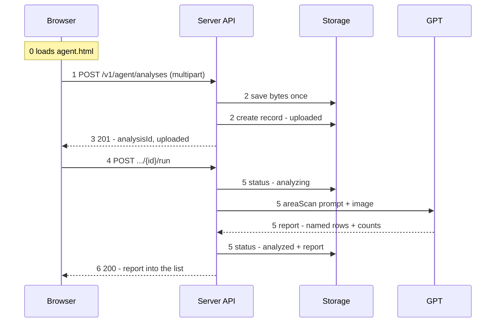

# AI Shop Agent Upload Path

## Purpose

Describe the path one photograph takes from a browser to a counted
shelf. Low-level design behind Sprint 008.

## Shape

Upload and analysis are **two separate calls**. Everything up to the
acknowledgement is durable and cheap; only the run spends money, and
only after something has explicitly asked for it.

## What this path does not claim

The result is open-world. A name in a report is what a model read off a
package, not a match against a catalog and not a reviewed fact. Catalog
matching is a later increment and will change what the rows mean.

## Companion documents

- [Who fires the run](architecture-05-agent-run-decision.md)
- [Upload, step by step](architecture-06-agent-upload-steps.md)
- [Analysis, step by step](architecture-07-agent-analysis-steps.md)
