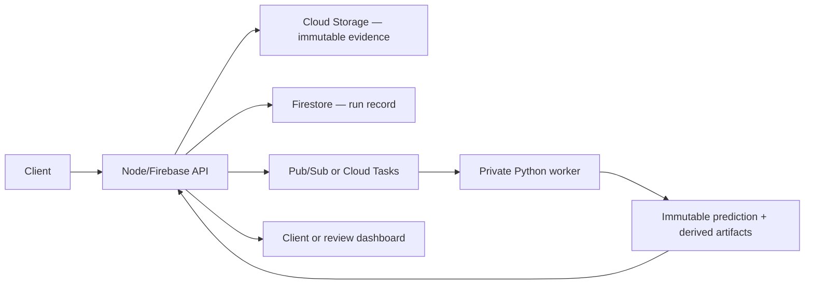

# Agent AI — Target Decision and Topology

**Status: PROPOSED — not built, not approved.** Transcribed from the
VISTA Agent AI handoff of 2026-09-06. It describes a target, not the
running system; what exists today is in
[high-level-architecture](high-level-architecture.md) and
[architecture-04](architecture-04-agent-upload-path.md).

## Decision

Extend AI Shop with a private asynchronous **Python recognition worker**
while preserving the current **Node/Firebase service as the public
boundary and orchestration control plane**. Both runtimes share one
Firebase/GCP project, contracts, and evidence model. Not a second
product; no second Firebase project. The existing Node service is not
rewritten.

## Logical topology

## Boundaries

- **Public** — the existing authenticated Node endpoints. The mobile app
  and dashboard never call the worker directly.
- **Private** — queue subscription and worker service identity.
  Unauthenticated or wrongly scoped invocation is rejected.
- **External** — model and OCR providers are called only by the worker,
  through server-side secrets and explicit time and cost budgets.
- **Persistent** — Cloud Storage holds immutable source media and
  versioned derived artifacts; Firestore holds state, references,
  summaries, reviews and metrics.

## Deployment choice

Default to a private event-driven Firebase/GCP function when package
size, execution time, memory, concurrency and video limits fit the
measured workload. A separately deployed Cloud Run worker only when
benchmarks show functions are insufficient. The queue and the contracts
isolate this choice: no client contract depends on the worker platform.
