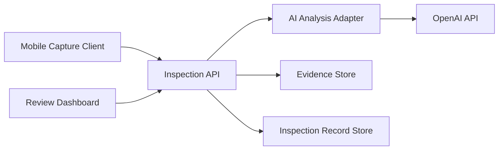

# AI Shop Component Architecture

HumanReviewerInitials:PME

## Purpose

Define stable component boundaries so each implementation task changes exactly one component.

## Component model

## Responsibilities

| Component | Responsibility |
| --- | --- |
| Mobile Capture Client | Capture original JPEG bytes, mode, app version, target position, submit them, and display results. |
| Inspection API | Authenticate callers, validate requests, assign scan IDs, orchestrate submission and review operations, and return contracts. |
| AI Analysis Adapter | Build mode-specific model instructions, call OpenAI, and normalize structured initial findings. |
| Evidence Store | Hash and preserve original image bytes at private, unique, non-overwriting paths. |
| Inspection Record Store | Persist scan metadata, immutable initial findings, status, failures, and attributable review history. |
| Review Dashboard | Authenticate reviewers and present inspection lists, detail, evidence, findings, and disposition controls. |
| OpenAI API | External image-capable model service; it is outside the AI Shop codebase. |

## Boundaries

- Components communicate through explicit request, result, or storage contracts.
- The Mobile Capture Client and Review Dashboard never access storage or OpenAI directly.
- The Inspection API coordinates components but does not replace their internal responsibilities.
- Initial AI findings and original evidence are immutable after persistence.
- Cross-component work is split into ordered tasks; integration validation may observe several components without modifying them.

## Sprint 003 use

Every Sprint Plan Tasks entry names one component from this document. A task may change files owned by that component only.
