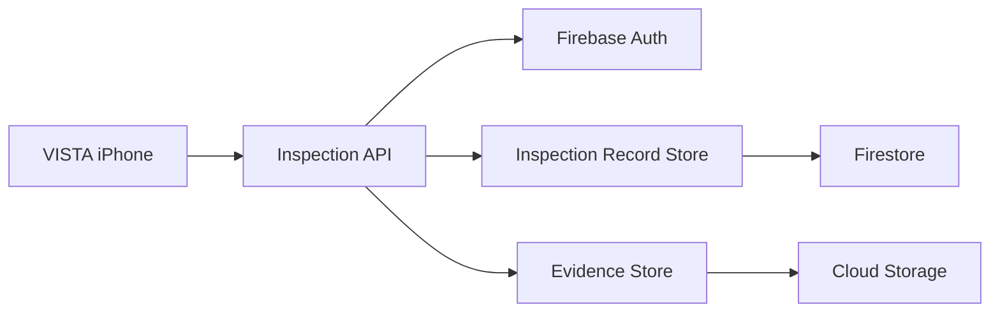

# VISTA Package Ingest Responsibility Cards

HumanReviewerInitials: PME

## Inspection API

- Purpose: authenticate and validate one complete declared VISTA package.
- Owns: limits, multipart/schema checks, error precedence, and orchestration.
- Does not own: client completeness, evidence retention, or server analysis.
- Collaborators: Firebase Auth, Evidence Store, and Inspection Record Store.
- Failure: bounded JSON errors; no durable state before full validation.

## Evidence Store

- Purpose: preserve exact manifest, audit, and JPEG bytes privately.
- Owns: recomputed hashes, server paths, metadata, and create-only verification.
- Does not own: receipts, package conflict decisions, or artifact deletion.
- Failure: reports persistence unavailable and never overwrites evidence.

## Inspection Record Store

- Purpose: authorize one immutable receipt per owner and normalized run.
- Owns: transactional reservation, conflict, finalization, and retry decisions.
- Does not own: request parsing, object bytes, analysis, or review state.
- Failure: remains truthfully `receiving`; a same-manifest retry may resume.
- Known debt: resume emits a bounded diagnostic, but proactive stale detection
  awaits an approved age threshold and monitoring policy.

## Flow

Implemented: API, stores, Firebase adapters, exact-byte real JPEG validation,
and emulator contention. Deployment qualification remains pending.
