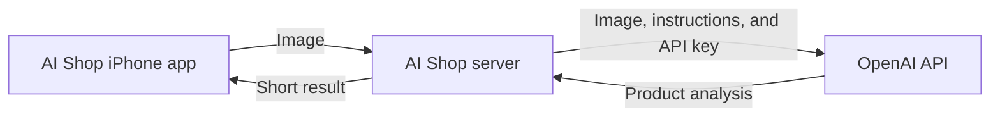

# AI Shop — High-Level Architecture

HumanReviewerInitials: PME
## Purpose

Define the smallest secure architecture that lets the AI Shop iPhone app capture a product image, request AI analysis, and display the result.

## Architecture

## Components

### AI Shop iPhone app

Controls the camera, captures the image, shows the analyzing state, sends the image to the AI Shop server, and displays the returned message. It never contains the OpenAI API key.

### AI Shop server

Provides one secure HTTPS endpoint. It receives the image, adds the analysis instructions, calls the OpenAI API with the protected credential, and returns a small result to the app.

The Sprint 001 server does not require a database and does not retain the image after the request completes.

### OpenAI API

Receives the image and instructions through the server, runs an image-capable model, and returns the product analysis. AI Shop uses the OpenAI API, not the consumer ChatGPT application.

## Request flow

1. Pablo captures a product image in AI Shop.
2. The iPhone app uploads the image to the AI Shop server.
3. The server sends the image and instructions to the OpenAI API.
4. The model returns its analysis to the server.
5. The server returns a short result to the iPhone app.
6. The app displays the result in the upper camera interface.

## Security boundary

The iPhone is an untrusted client for credential storage. A permanent OpenAI API key must remain in the server environment, where it cannot be extracted from the installed app.

Pablo's ChatGPT login and subscription are not used by AI Shop. OpenAI API access has separate developer credentials and usage.

## Sprint 001 boundary

This architecture supports one image request and one short response. Catalogs, grocery lists, price history, accounts, conversations, image storage, and production infrastructure remain outside Sprint 001.
