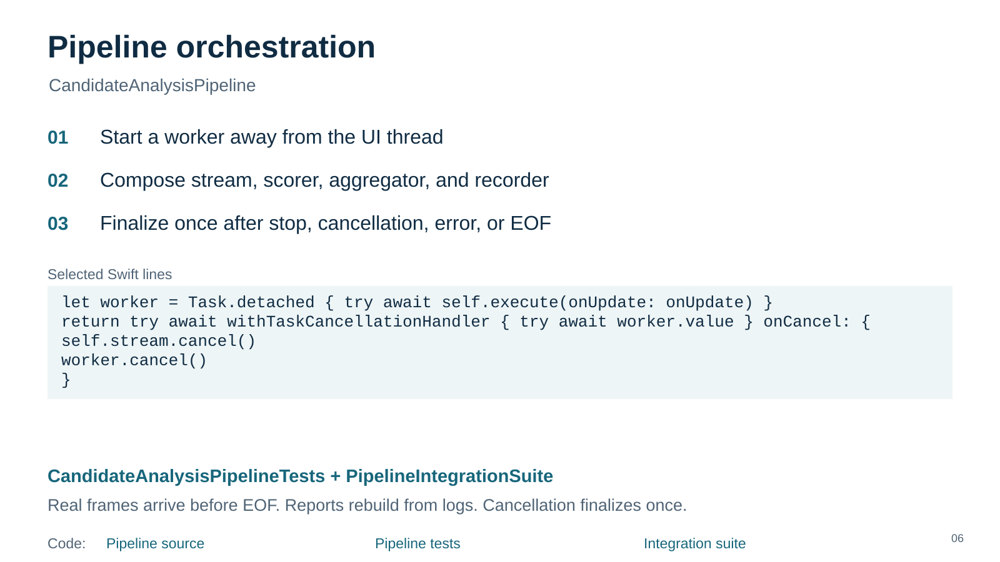
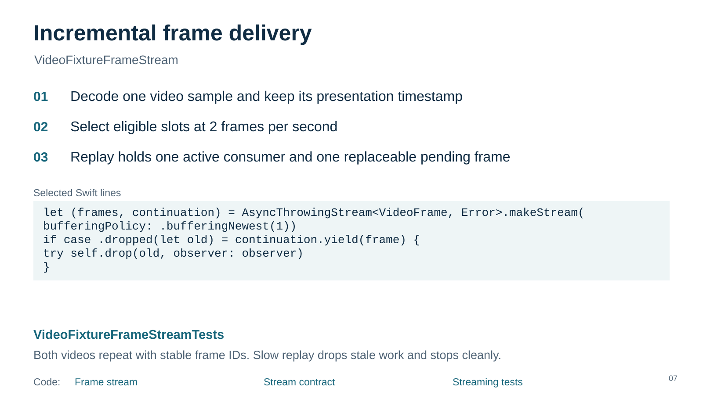
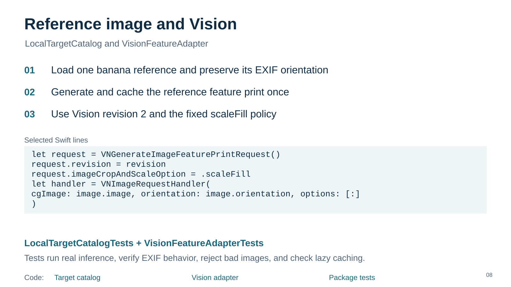
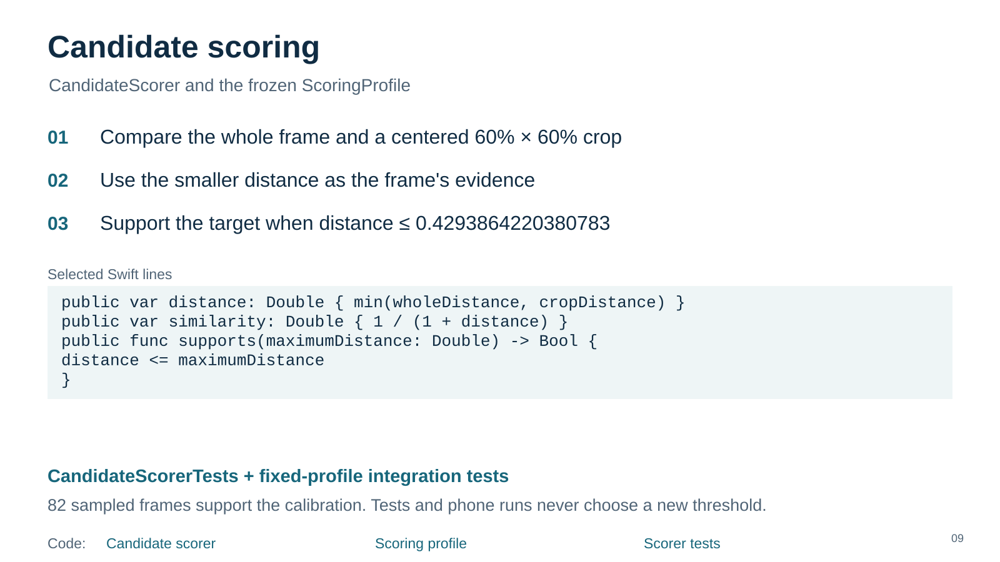
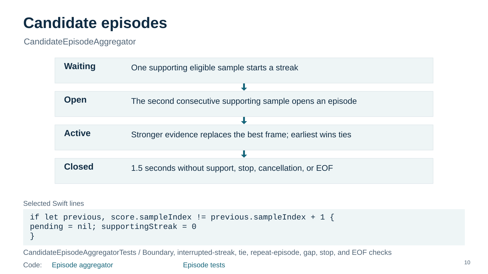
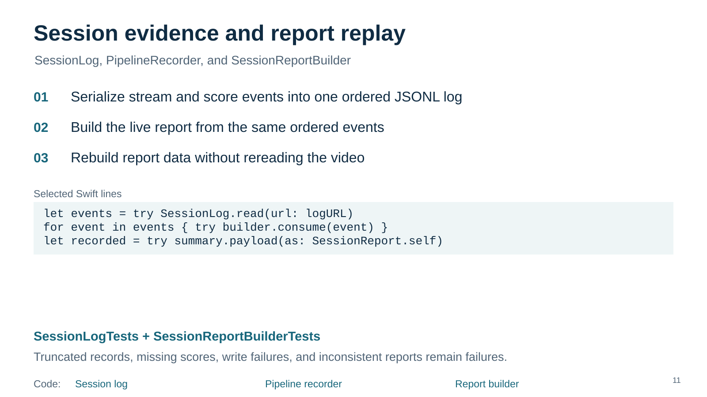
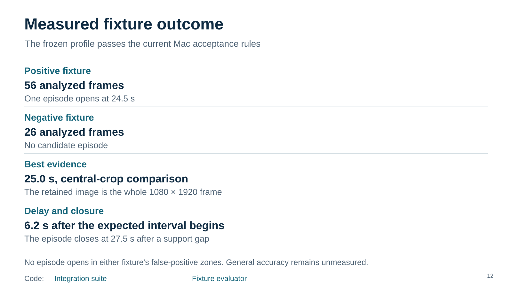
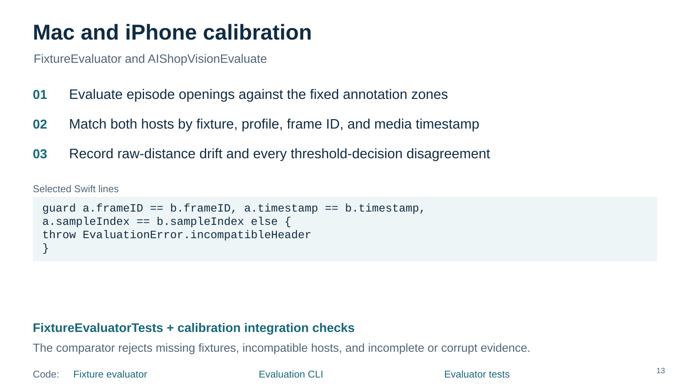
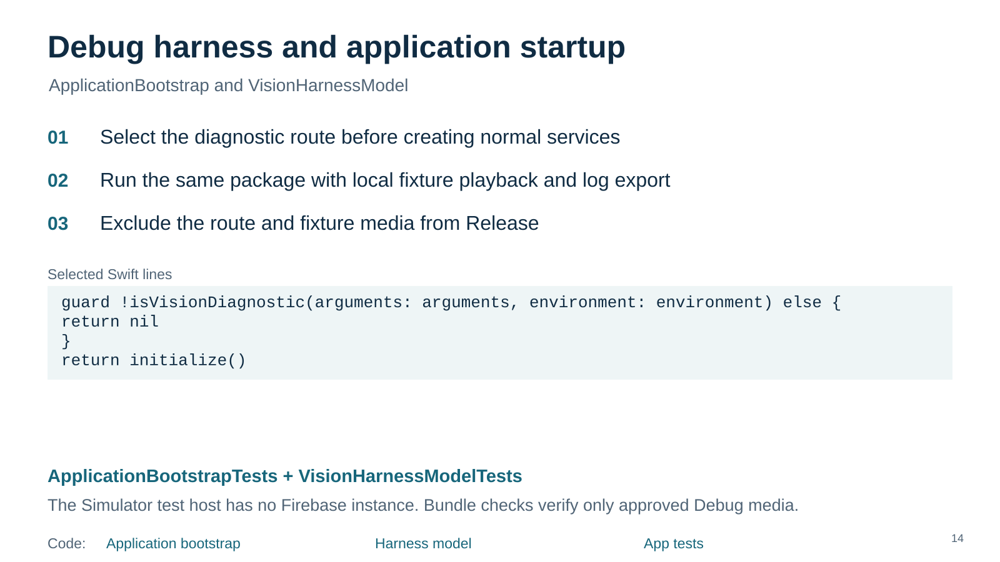
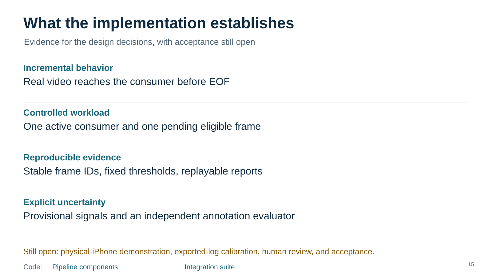

# Code and test walkthrough

Slides scale to the document width. Read and scroll vertically.

Code: [Pipeline source](../../../ios/AIShop/AIShopVision/Sources/AIShopVision/CandidateAnalysisPipeline/CandidateAnalysisPipeline.swift) · [Pipeline tests](../../../ios/AIShop/AIShopVision/Tests/AIShopVisionTests/CandidateAnalysisPipelineTests.swift) · [Integration suite](../../../ios/AIShop/AIShopVision/Tests/AIShopVisionTests/PipelineIntegrationSuite.swift) — [Speaker notes](06-orchestration/speaker-notes.md)

Code: [Frame stream](../../../ios/AIShop/AIShopVision/Sources/AIShopVision/VideoFixtureFrameStream/VideoFixtureFrameStream.swift) · [Stream contract](../../../ios/AIShop/AIShopVision/Sources/AIShopVision/VideoFixtureFrameStream/FrameStream.swift) · [Streaming tests](../../../ios/AIShop/AIShopVision/Tests/AIShopVisionTests/VideoFixtureFrameStreamTests.swift) — [Speaker notes](07-streaming/speaker-notes.md)

Code: [Target catalog](../../../ios/AIShop/AIShopVision/Sources/AIShopVision/LocalTargetCatalog/LocalTargetCatalog.swift) · [Vision adapter](../../../ios/AIShop/AIShopVision/Sources/AIShopVision/VisionFeatureAdapter.swift) · [Package tests](../../../ios/AIShop/AIShopVision/Tests/AIShopVisionTests) — [Speaker notes](08-target-and-vision/speaker-notes.md)

Code: [Candidate scorer](../../../ios/AIShop/AIShopVision/Sources/AIShopVision/CandidateScorer/CandidateScorer.swift) · [Scoring profile](../../../ios/AIShop/AIShopVision/Sources/AIShopVision/CandidateScorer/ScoringProfile.swift) · [Scorer tests](../../../ios/AIShop/AIShopVision/Tests/AIShopVisionTests/CandidateScorerTests.swift) — [Speaker notes](09-scoring/speaker-notes.md)

Code: [Episode aggregator](../../../ios/AIShop/AIShopVision/Sources/AIShopVision/CandidateEpisodeAggregator/CandidateEpisodeAggregator.swift) · [Episode tests](../../../ios/AIShop/AIShopVision/Tests/AIShopVisionTests/CandidateEpisodeAggregatorTests.swift) — [Speaker notes](10-episodes/speaker-notes.md)

Code: [Session log](../../../ios/AIShop/AIShopVision/Sources/AIShopVision/SessionLog/SessionLog.swift) · [Pipeline recorder](../../../ios/AIShop/AIShopVision/Sources/AIShopVision/CandidateAnalysisPipeline/PipelineRecorder.swift) · [Report builder](../../../ios/AIShop/AIShopVision/Sources/AIShopVision/SessionReportBuilder/SessionReportBuilder.swift) — [Speaker notes](11-session-evidence/speaker-notes.md)

Code: [Integration suite](../../../ios/AIShop/AIShopVision/Tests/AIShopVisionTests/PipelineIntegrationSuite.swift) · [Fixture evaluator](../../../ios/AIShop/AIShopVision/Sources/AIShopVisionEvaluation/FixtureEvaluator.swift) — [Speaker notes](12-fixture-results/speaker-notes.md)

Code: [Fixture evaluator](../../../ios/AIShop/AIShopVision/Sources/AIShopVisionEvaluation/FixtureEvaluator.swift) · [Evaluation CLI](../../../ios/AIShop/AIShopVision/Sources/AIShopVisionEvaluate/main.swift) · [Evaluator tests](../../../ios/AIShop/AIShopVision/Tests/AIShopVisionTests/FixtureEvaluatorTests.swift) — [Speaker notes](13-calibration/speaker-notes.md)

Code: [Application bootstrap](../../../ios/AIShop/AIShop/App/ApplicationBootstrap.swift) · [Harness model](../../../ios/AIShop/AIShop/Diagnostics/VisionHarnessModel.swift) · [App tests](../../../ios/AIShop/AIShopTests) — [Speaker notes](14-app-boundary/speaker-notes.md)

Code: [Pipeline components](../../../ios/AIShop/AIShopVision/Sources/AIShopVision) · [Integration suite](../../../ios/AIShop/AIShopVision/Tests/AIShopVisionTests/PipelineIntegrationSuite.swift) — [Speaker notes](15-review/speaker-notes.md)

