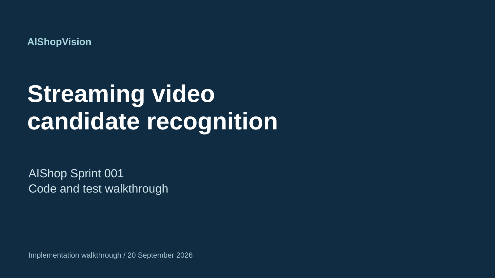
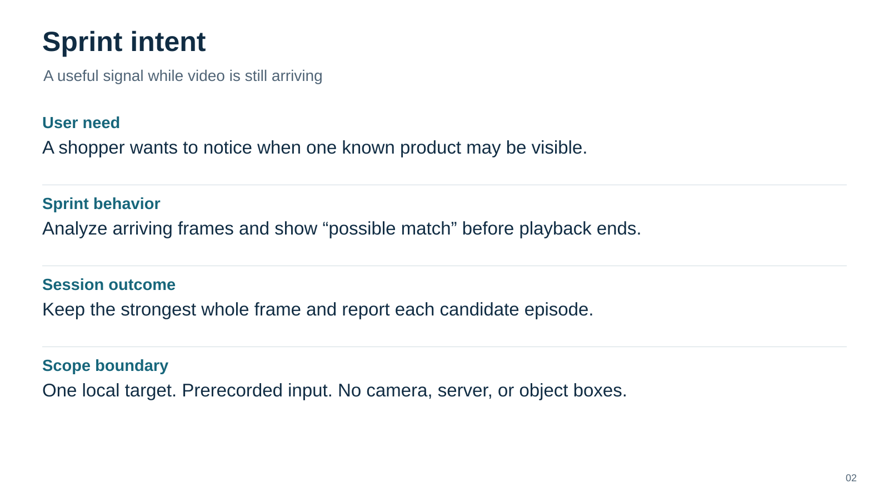
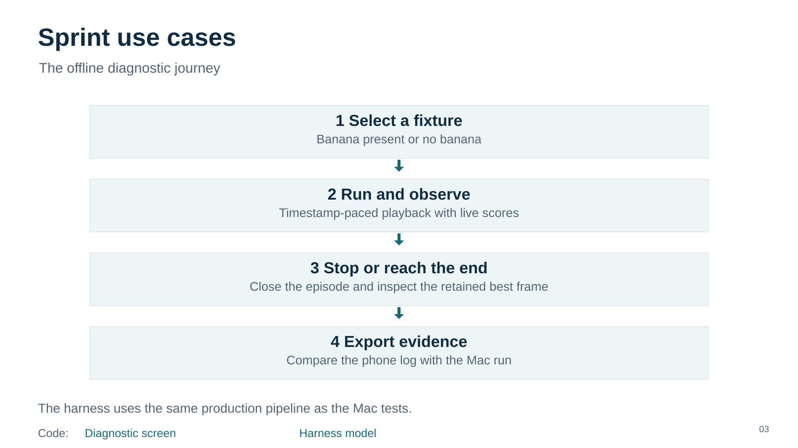
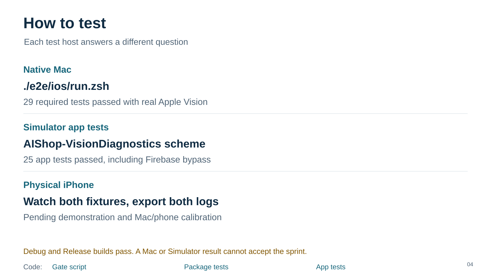
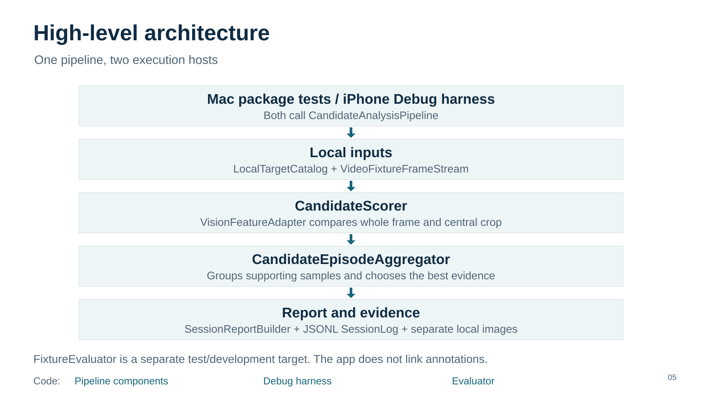

# Overview

Slides scale to the document width. Read and scroll vertically.

[Speaker notes](01-title/speaker-notes.md)

[Speaker notes](02-intent/speaker-notes.md)

Code: [Diagnostic screen](../../../ios/AIShop/AIShop/Diagnostics/VisionDiagnosticHarness.swift) · [Harness model](../../../ios/AIShop/AIShop/Diagnostics/VisionHarnessModel.swift) — [Speaker notes](03-use-cases/speaker-notes.md)

Code: [Gate script](../../../e2e/ios/run.zsh) · [Package tests](../../../ios/AIShop/AIShopVision/Tests/AIShopVisionTests) · [App tests](../../../ios/AIShop/AIShopTests) — [Speaker notes](04-how-to-test/speaker-notes.md)

Code: [Pipeline components](../../../ios/AIShop/AIShopVision/Sources/AIShopVision) · [Debug harness](../../../ios/AIShop/AIShop/Diagnostics) · [Evaluator](../../../ios/AIShop/AIShopVision/Sources/AIShopVisionEvaluation) — [Speaker notes](05-architecture/speaker-notes.md)

