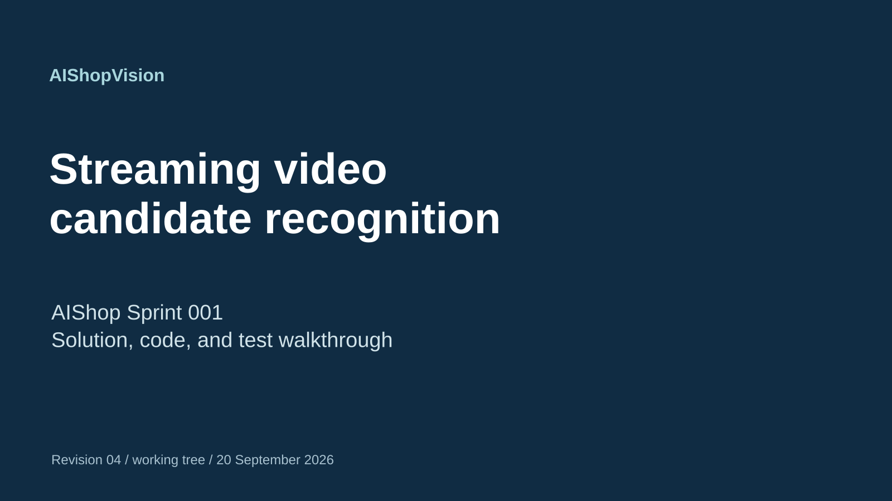
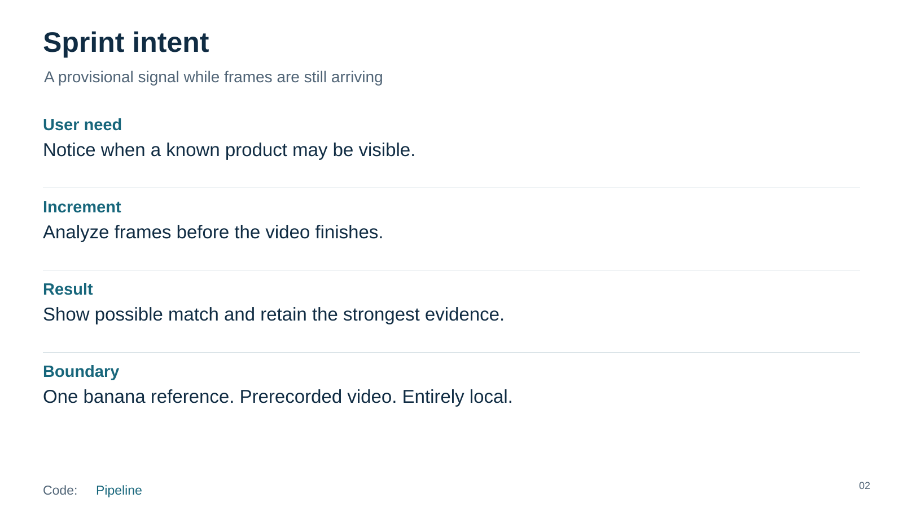
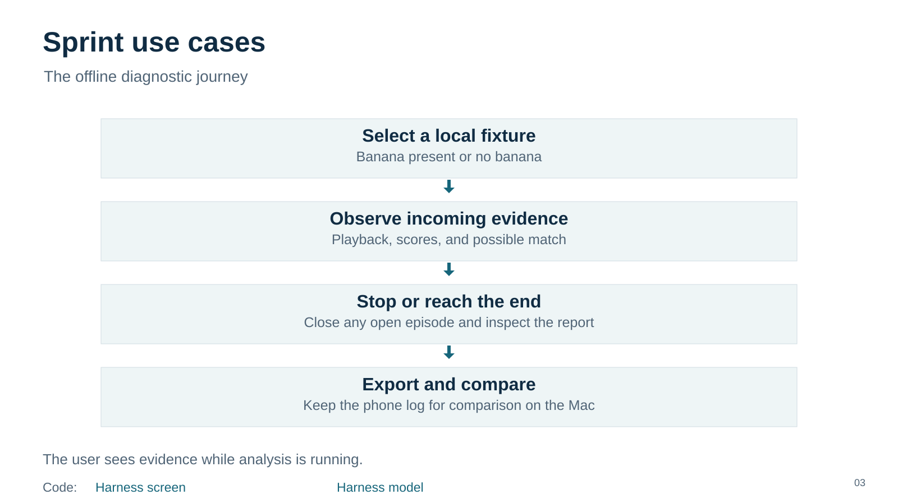
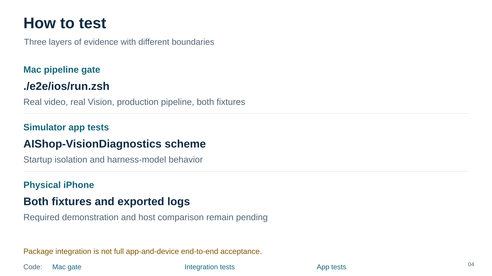
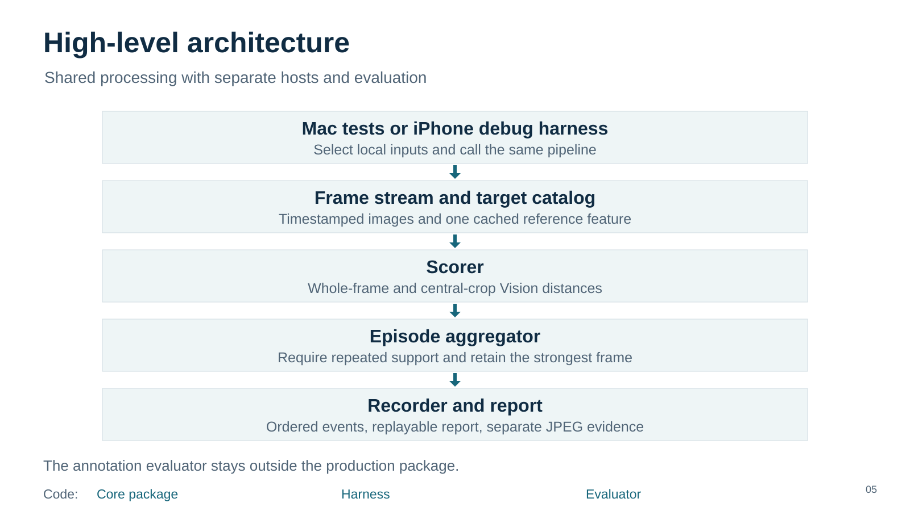
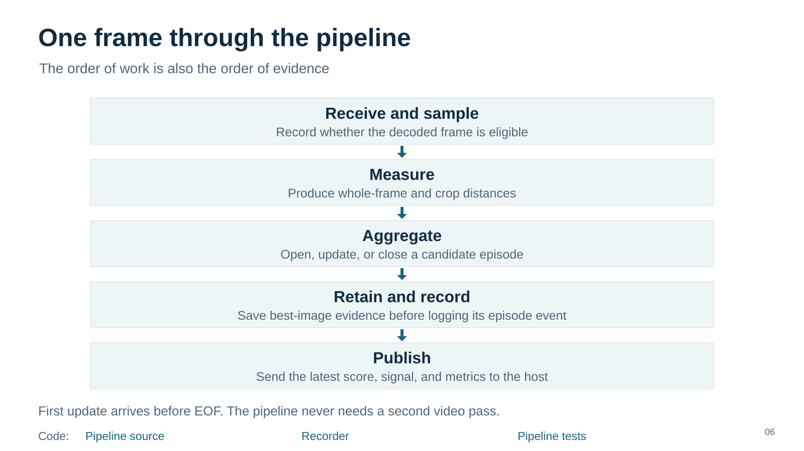
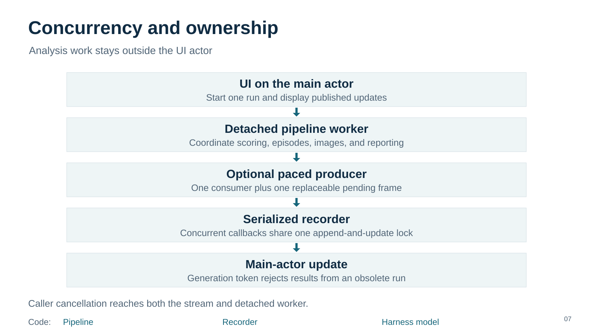

# Foundations

Revision 04. Read vertically. Code links work here; video links are visual only.

[Speaker notes](01-title/speaker-notes.md)

[Pipeline](../../../../../ios/AIShop/AIShopVision/Sources/AIShopVision/CandidateAnalysisPipeline/CandidateAnalysisPipeline.swift) · [Speaker notes](02-intent/speaker-notes.md)

[Harness screen](../../../../../ios/AIShop/AIShop/Diagnostics/VisionDiagnosticHarness.swift) · [Harness model](../../../../../ios/AIShop/AIShop/Diagnostics/VisionHarnessModel.swift) · [Speaker notes](03-use-cases/speaker-notes.md)

[Mac gate](../../../../../e2e/ios/run.zsh) · [Integration tests](../../../../../ios/AIShop/AIShopVision/Tests/AIShopVisionTests/PipelineIntegrationSuite.swift) · [App tests](../../../../../ios/AIShop/AIShopTests) · [Speaker notes](04-how-to-test/speaker-notes.md)

[Core package](../../../../../ios/AIShop/AIShopVision/Sources/AIShopVision) · [Harness](../../../../../ios/AIShop/AIShop/Diagnostics) · [Evaluator](../../../../../ios/AIShop/AIShopVision/Sources/AIShopVisionEvaluation) · [Speaker notes](05-architecture/speaker-notes.md)

[Pipeline source](../../../../../ios/AIShop/AIShopVision/Sources/AIShopVision/CandidateAnalysisPipeline/CandidateAnalysisPipeline.swift) · [Recorder](../../../../../ios/AIShop/AIShopVision/Sources/AIShopVision/CandidateAnalysisPipeline/PipelineRecorder.swift) · [Pipeline tests](../../../../../ios/AIShop/AIShopVision/Tests/AIShopVisionTests/CandidateAnalysisPipelineTests.swift) · [Speaker notes](06-frame-flow/speaker-notes.md)

[Pipeline](../../../../../ios/AIShop/AIShopVision/Sources/AIShopVision/CandidateAnalysisPipeline/CandidateAnalysisPipeline.swift) · [Recorder](../../../../../ios/AIShop/AIShopVision/Sources/AIShopVision/CandidateAnalysisPipeline/PipelineRecorder.swift) · [Harness model](../../../../../ios/AIShop/AIShop/Diagnostics/VisionHarnessModel.swift) · [Speaker notes](07-concurrency/speaker-notes.md)

