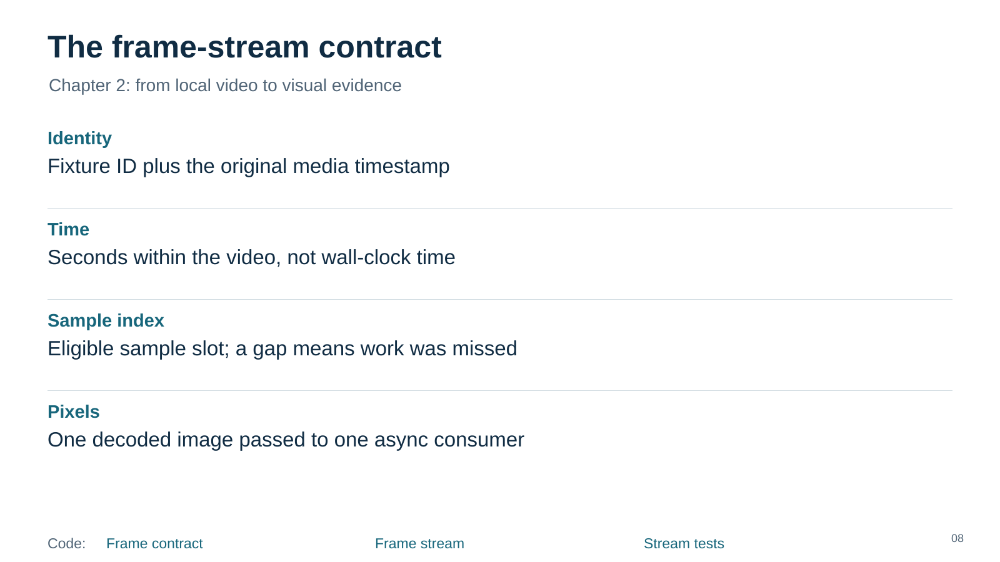
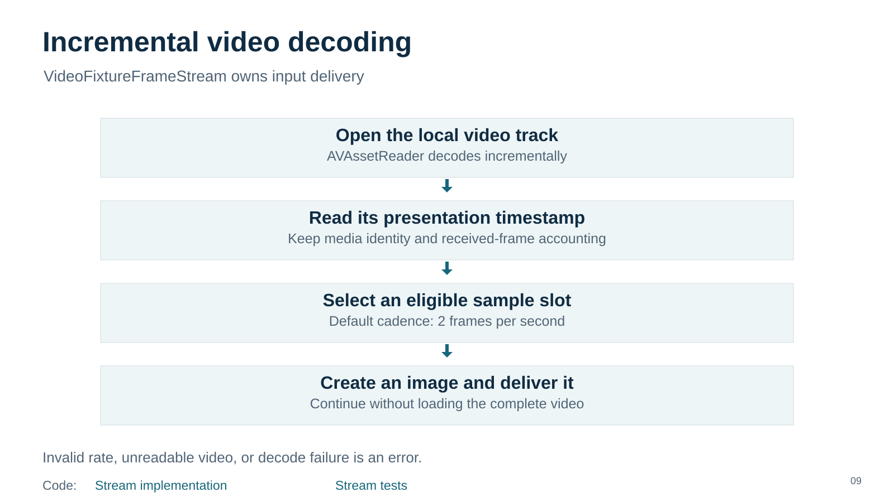
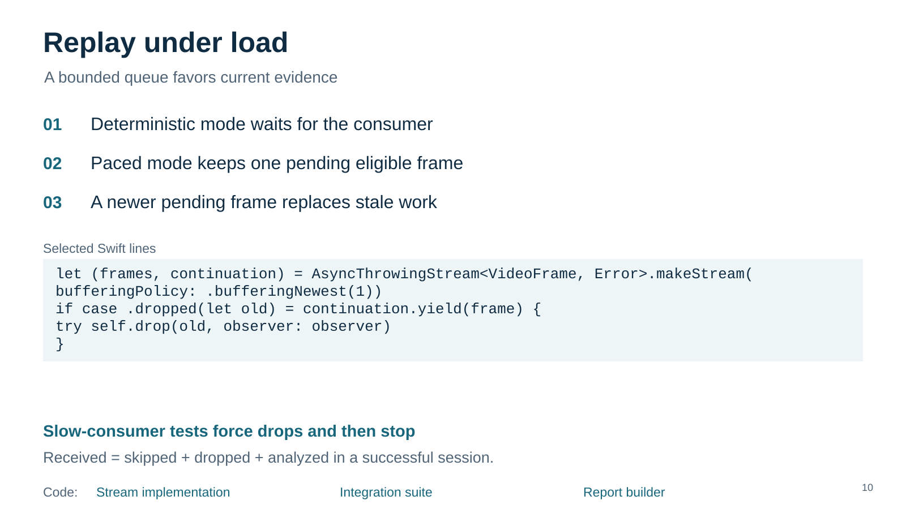
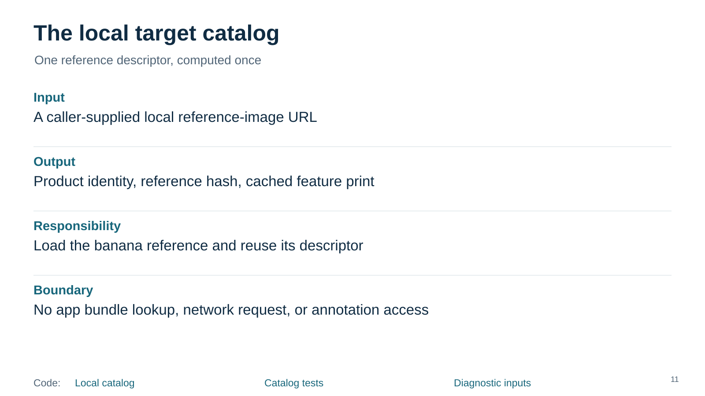
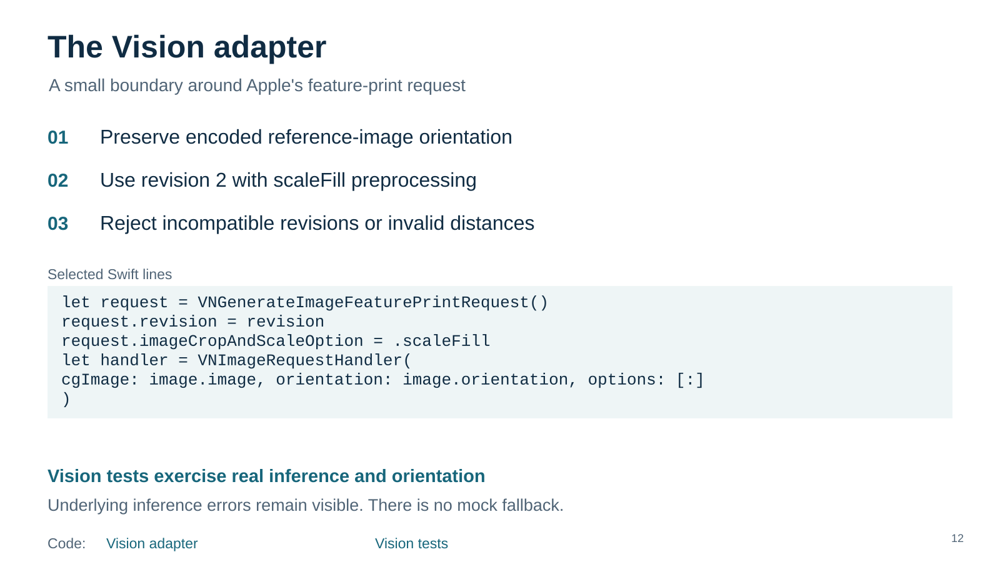
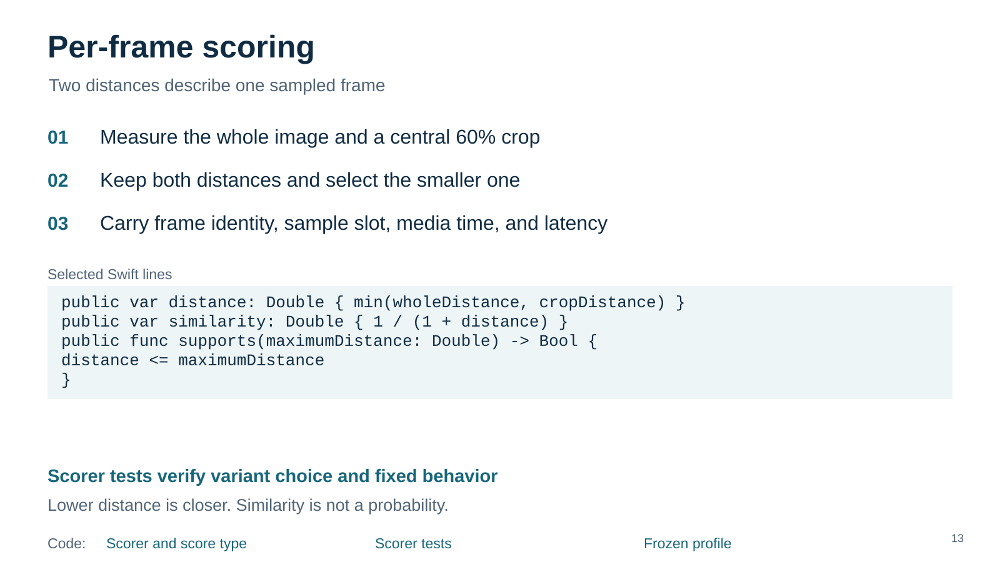
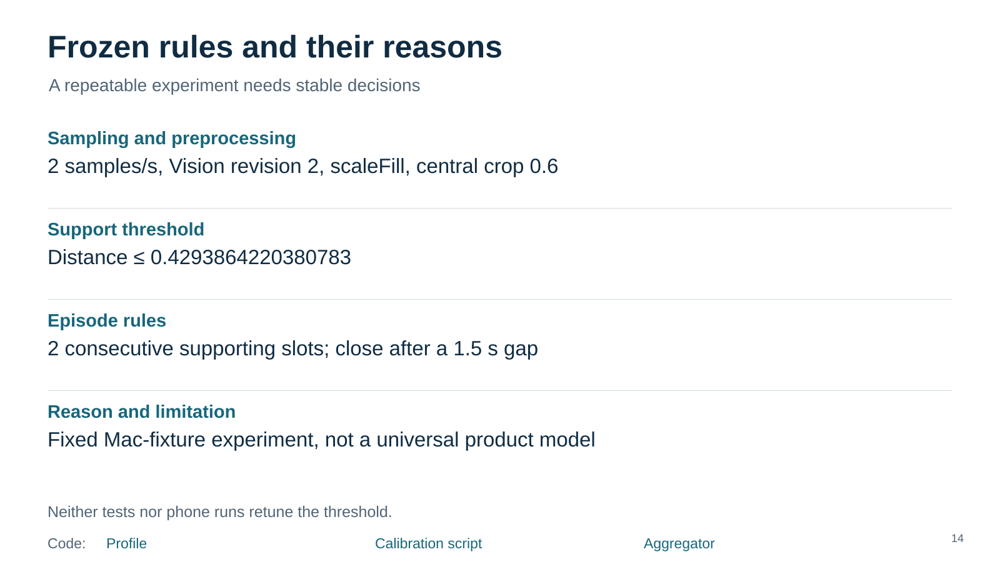

# Frame analysis

Revision 09. Read vertically. Code links work here; video links are visual only.

[Frame contract](../../../../../ios/AIShop/AIShopVision/Sources/AIShopVision/VideoFixtureFrameStream/FrameStream.swift) · [Frame stream](../../../../../ios/AIShop/AIShopVision/Sources/AIShopVision/VideoFixtureFrameStream/VideoFixtureFrameStream.swift) · [Stream tests](../../../../../ios/AIShop/AIShopVision/Tests/AIShopVisionTests/VideoFixtureFrameStreamTests.swift) · [Speaker notes](08-frame-contract/speaker-notes.md)

[Stream implementation](../../../../../ios/AIShop/AIShopVision/Sources/AIShopVision/VideoFixtureFrameStream/VideoFixtureFrameStream.swift) · [Stream tests](../../../../../ios/AIShop/AIShopVision/Tests/AIShopVisionTests/VideoFixtureFrameStreamTests.swift) · [Speaker notes](09-streaming/speaker-notes.md)

[Stream implementation](../../../../../ios/AIShop/AIShopVision/Sources/AIShopVision/VideoFixtureFrameStream/VideoFixtureFrameStream.swift) · [Integration suite](../../../../../ios/AIShop/AIShopVision/Tests/AIShopVisionTests/PipelineIntegrationSuite.swift) · [Report builder](../../../../../ios/AIShop/AIShopVision/Sources/AIShopVision/SessionReportBuilder/SessionReportBuilder.swift) · [Speaker notes](10-replay-pressure/speaker-notes.md)

[Local catalog](../../../../../ios/AIShop/AIShopVision/Sources/AIShopVision/LocalTargetCatalog/LocalTargetCatalog.swift) · [Catalog tests](../../../../../ios/AIShop/AIShopVision/Tests/AIShopVisionTests/LocalTargetCatalogTests.swift) · [Diagnostic inputs](../../../../../ios/AIShop/AIShop/Diagnostics/DiagnosticFixture.swift) · [Speaker notes](11-target/speaker-notes.md)

[Vision adapter](../../../../../ios/AIShop/AIShopVision/Sources/AIShopVision/VisionFeatureAdapter.swift) · [Vision tests](../../../../../ios/AIShop/AIShopVision/Tests/AIShopVisionTests/VisionFeatureAdapterTests.swift) · [Speaker notes](12-vision/speaker-notes.md)

[Scorer and score type](../../../../../ios/AIShop/AIShopVision/Sources/AIShopVision/CandidateScorer/CandidateScorer.swift) · [Scorer tests](../../../../../ios/AIShop/AIShopVision/Tests/AIShopVisionTests/CandidateScorerTests.swift) · [Frozen profile](../../../../../ios/AIShop/AIShopVision/Sources/AIShopVision/CandidateScorer/ScoringProfile.swift) · [Speaker notes](13-scorer/speaker-notes.md)

[Profile](../../../../../ios/AIShop/AIShopVision/Sources/AIShopVision/CandidateScorer/ScoringProfile.swift) · [Calibration script](../../../../../e2e/ios/calibrate-scorer.rb) · [Aggregator](../../../../../ios/AIShop/AIShopVision/Sources/AIShopVision/CandidateEpisodeAggregator/CandidateEpisodeAggregator.swift) · [Speaker notes](14-rules/speaker-notes.md)

