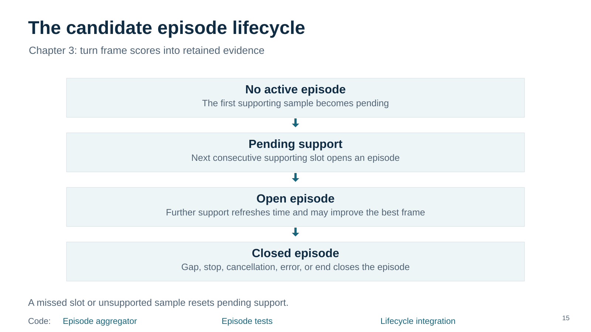
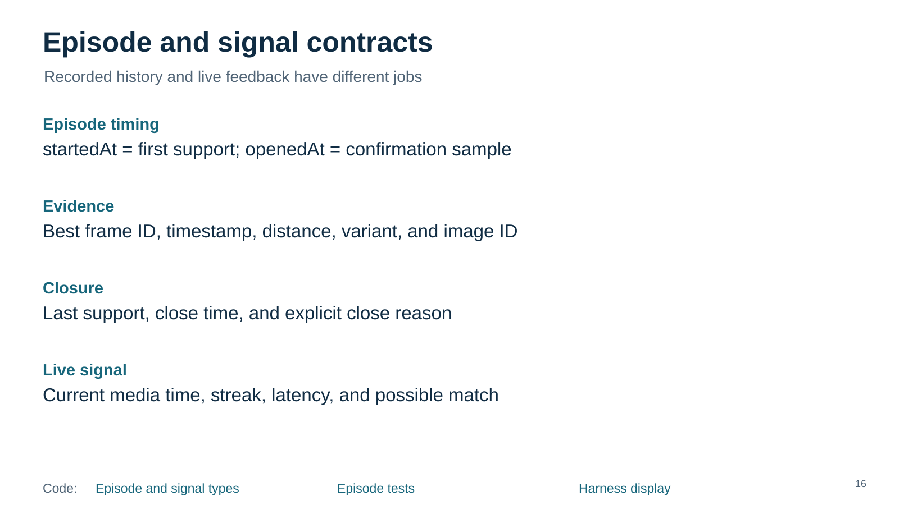
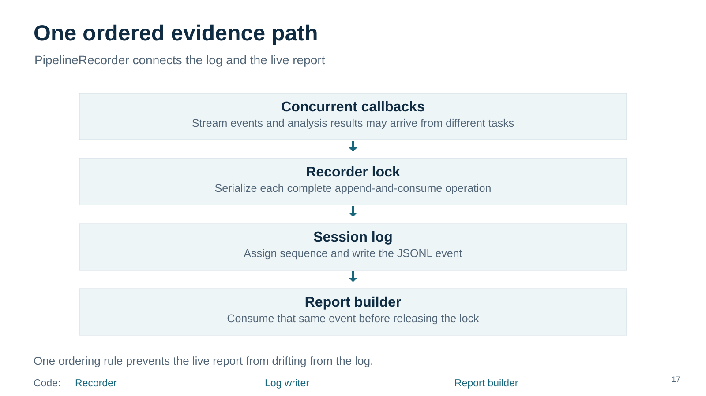
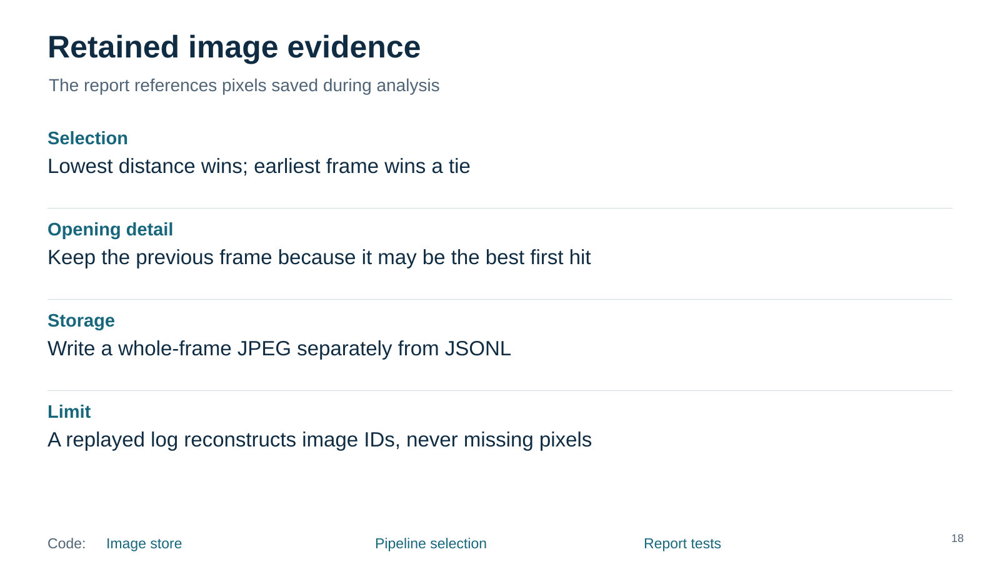
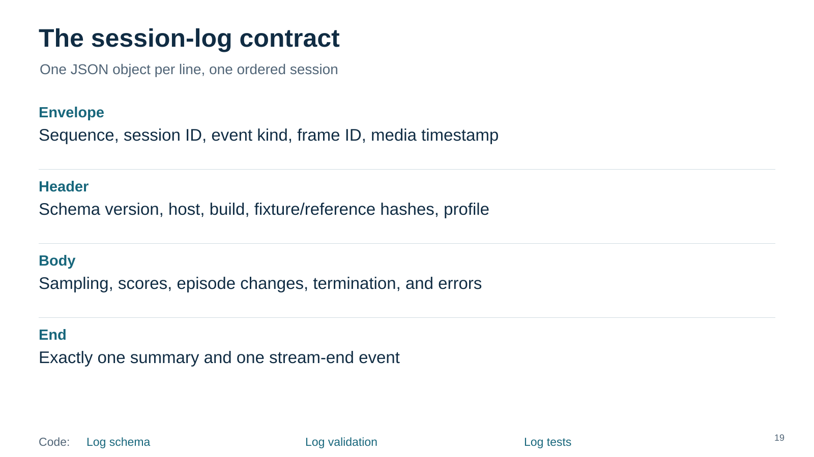
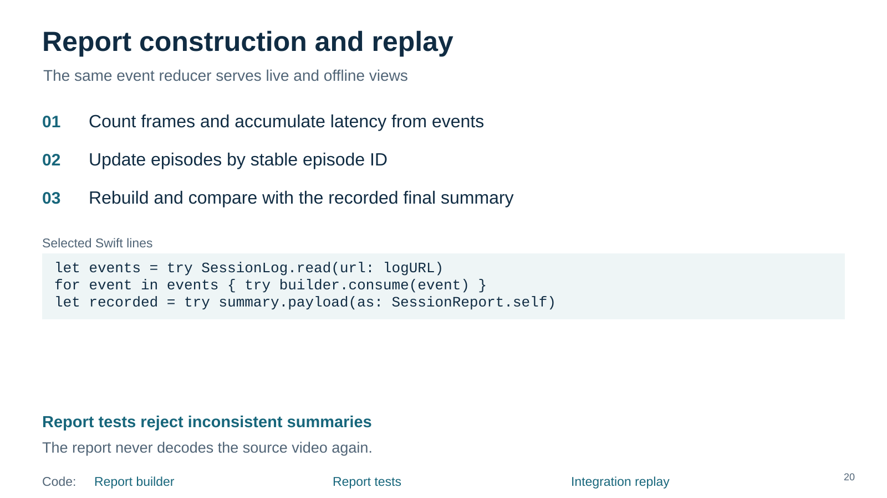
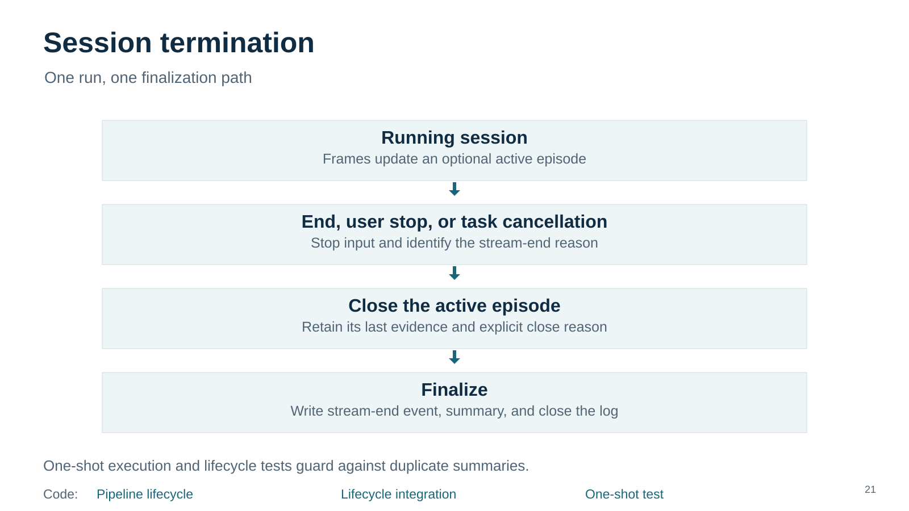
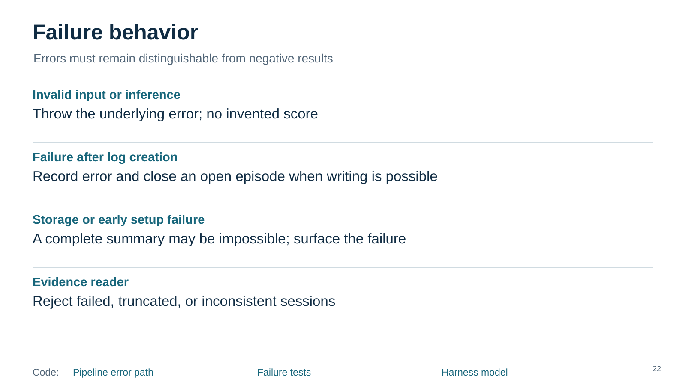

# Episodes and evidence

Revision 09. Read vertically. Code links work here; video links are visual only.

[Episode aggregator](../../../../../ios/AIShop/AIShopVision/Sources/AIShopVision/CandidateEpisodeAggregator/CandidateEpisodeAggregator.swift) · [Episode tests](../../../../../ios/AIShop/AIShopVision/Tests/AIShopVisionTests/CandidateEpisodeAggregatorTests.swift) · [Lifecycle integration](../../../../../ios/AIShop/AIShopVision/Tests/AIShopVisionTests/PipelineIntegrationSuite.swift) · [Speaker notes](15-episode-state/speaker-notes.md)

[Episode and signal types](../../../../../ios/AIShop/AIShopVision/Sources/AIShopVision/CandidateEpisodeAggregator/CandidateEpisodeAggregator.swift) · [Episode tests](../../../../../ios/AIShop/AIShopVision/Tests/AIShopVisionTests/CandidateEpisodeAggregatorTests.swift) · [Harness display](../../../../../ios/AIShop/AIShop/Diagnostics/VisionDiagnosticHarness.swift) · [Speaker notes](16-episode-data/speaker-notes.md)

[Recorder](../../../../../ios/AIShop/AIShopVision/Sources/AIShopVision/CandidateAnalysisPipeline/PipelineRecorder.swift) · [Log writer](../../../../../ios/AIShop/AIShopVision/Sources/AIShopVision/SessionLog/SessionLog.swift) · [Report builder](../../../../../ios/AIShop/AIShopVision/Sources/AIShopVision/SessionReportBuilder/SessionReportBuilder.swift) · [Speaker notes](17-recorder/speaker-notes.md)

[Image store](../../../../../ios/AIShop/AIShopVision/Sources/AIShopVision/SessionReportBuilder/RetainedImageStore.swift) · [Pipeline selection](../../../../../ios/AIShop/AIShopVision/Sources/AIShopVision/CandidateAnalysisPipeline/CandidateAnalysisPipeline.swift) · [Report tests](../../../../../ios/AIShop/AIShopVision/Tests/AIShopVisionTests/SessionReportBuilderTests.swift) · [Speaker notes](18-images/speaker-notes.md)

[Log schema](../../../../../ios/AIShop/AIShopVision/Sources/AIShopVision/SessionLog/LogValue.swift) · [Log validation](../../../../../ios/AIShop/AIShopVision/Sources/AIShopVision/SessionLog/SessionLog.swift) · [Log tests](../../../../../ios/AIShop/AIShopVision/Tests/AIShopVisionTests/SessionLogTests.swift) · [Speaker notes](19-log-contract/speaker-notes.md)

[Report builder](../../../../../ios/AIShop/AIShopVision/Sources/AIShopVision/SessionReportBuilder/SessionReportBuilder.swift) · [Report tests](../../../../../ios/AIShop/AIShopVision/Tests/AIShopVisionTests/SessionReportBuilderTests.swift) · [Integration replay](../../../../../ios/AIShop/AIShopVision/Tests/AIShopVisionTests/PipelineIntegrationSuite.swift) · [Speaker notes](20-report-replay/speaker-notes.md)

[Pipeline lifecycle](../../../../../ios/AIShop/AIShopVision/Sources/AIShopVision/CandidateAnalysisPipeline/CandidateAnalysisPipeline.swift) · [Lifecycle integration](../../../../../ios/AIShop/AIShopVision/Tests/AIShopVisionTests/PipelineIntegrationSuite.swift) · [One-shot test](../../../../../ios/AIShop/AIShopVision/Tests/AIShopVisionTests/CandidateAnalysisPipelineTests.swift) · [Speaker notes](21-session-end/speaker-notes.md)

[Pipeline error path](../../../../../ios/AIShop/AIShopVision/Sources/AIShopVision/CandidateAnalysisPipeline/CandidateAnalysisPipeline.swift) · [Failure tests](../../../../../ios/AIShop/AIShopVision/Tests/AIShopVisionTests/CandidateAnalysisPipelineTests.swift) · [Harness model](../../../../../ios/AIShop/AIShop/Diagnostics/VisionHarnessModel.swift) · [Speaker notes](22-failures/speaker-notes.md)

