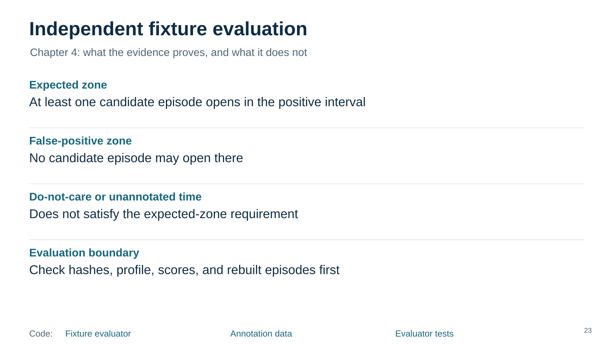
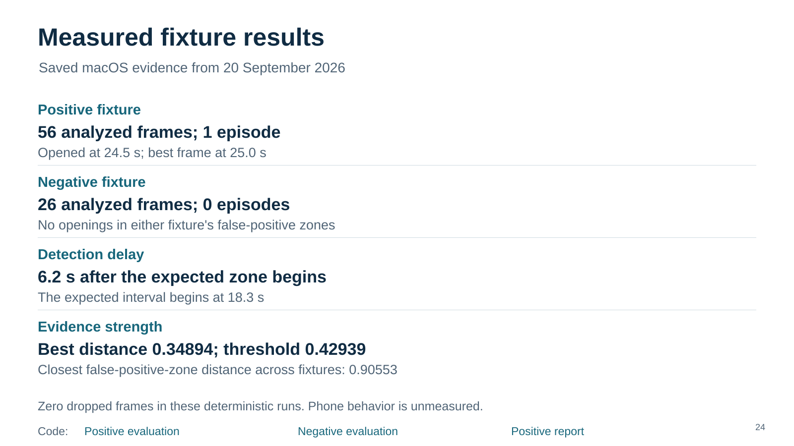
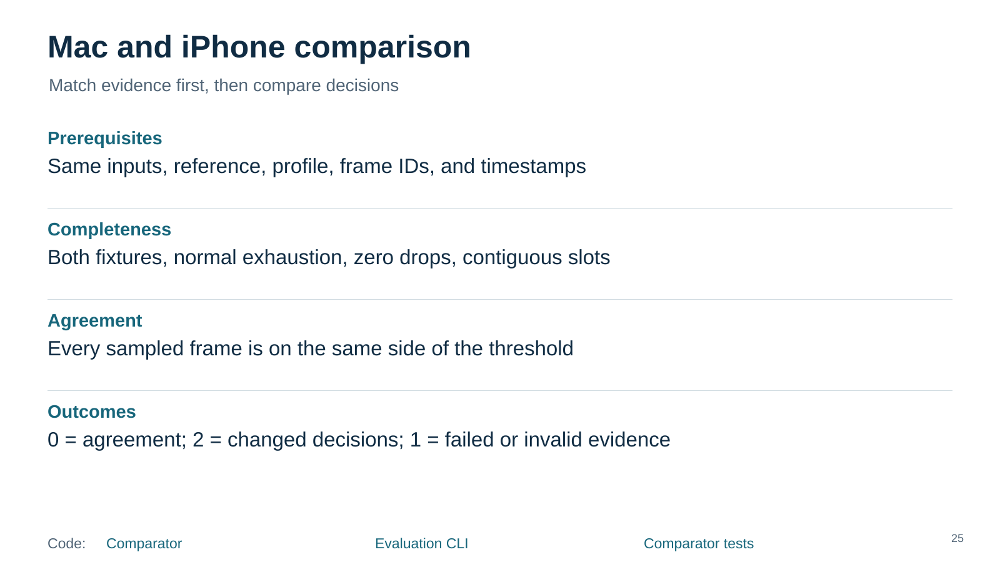
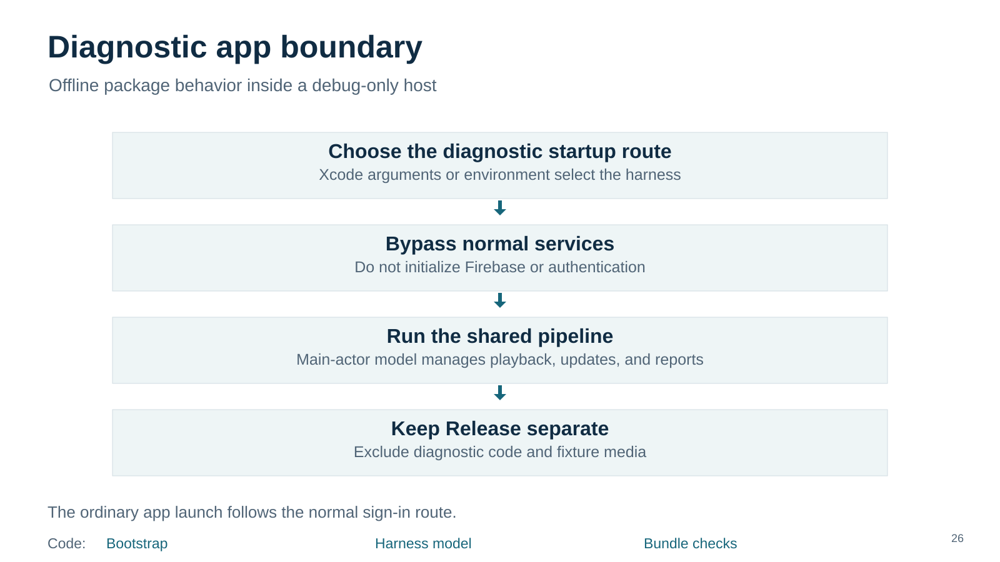
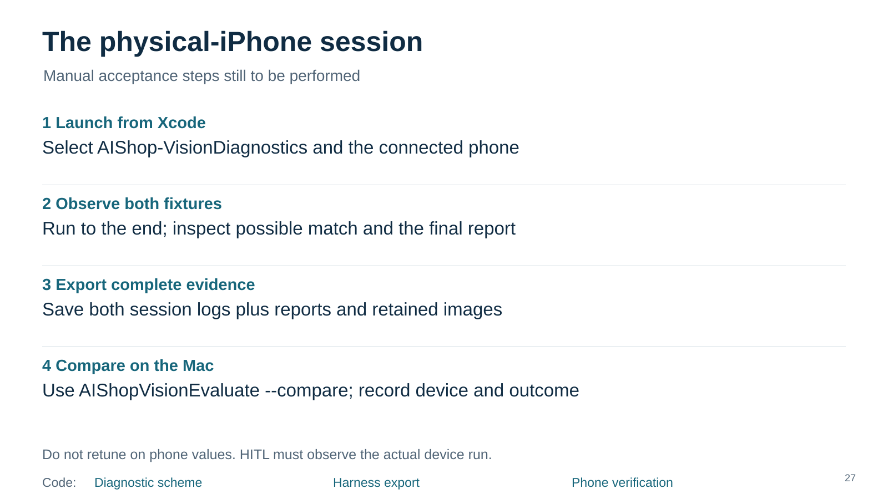
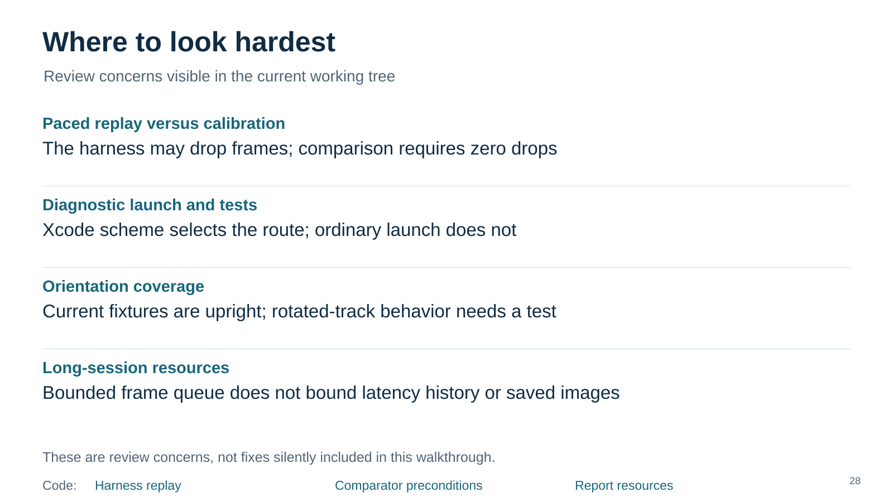
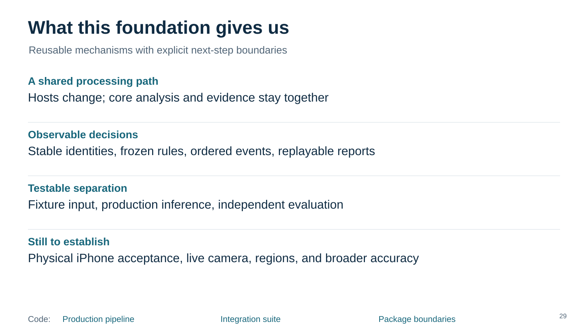
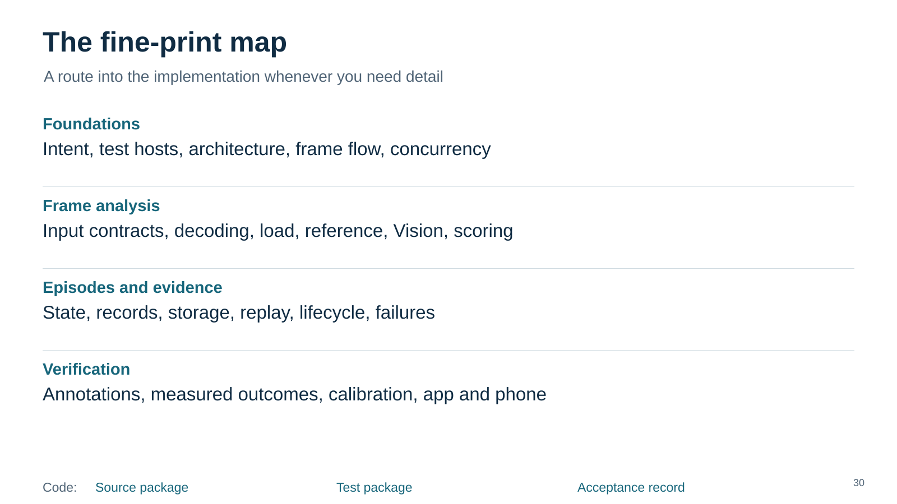

# Verification and iPhone

Revision 10. Read vertically. Code links work here; video links are visual only.

[Fixture evaluator](../../../../../ios/AIShop/AIShopVision/Sources/AIShopVisionEvaluation/FixtureEvaluator.swift) · [Annotation data](../../../../../ios/AIShop/AIShopVision/Tests/AIShopVisionTests/Resources/annotations.json) · [Evaluator tests](../../../../../ios/AIShop/AIShopVision/Tests/AIShopVisionTests/FixtureEvaluatorTests.swift) · [Speaker notes](23-evaluation/speaker-notes.md)

[Positive evaluation](../../artifacts/evidence/mac-positive/evaluation.json) · [Negative evaluation](../../artifacts/evidence/mac-negative/evaluation.json) · [Positive report](../../artifacts/evidence/mac-positive/report.json) · [Speaker notes](24-results/speaker-notes.md)

[Comparator](../../../../../ios/AIShop/AIShopVision/Sources/AIShopVisionEvaluation/FixtureEvaluator.swift) · [Evaluation CLI](../../../../../ios/AIShop/AIShopVision/Sources/AIShopVisionEvaluate/main.swift) · [Comparator tests](../../../../../ios/AIShop/AIShopVision/Tests/AIShopVisionTests/PipelineIntegrationSuite.swift) · [Speaker notes](25-calibration/speaker-notes.md)

[Bootstrap](../../../../../ios/AIShop/AIShop/App/ApplicationBootstrap.swift) · [Harness model](../../../../../ios/AIShop/AIShop/Diagnostics/VisionHarnessModel.swift) · [Bundle checks](../../../../../e2e/ios/verify-app-bundle.rb) · [Speaker notes](26-app-boundary/speaker-notes.md)

[Diagnostic scheme](../../../../../ios/AIShop/AIShop.xcodeproj/xcshareddata/xcschemes/AIShop-VisionDiagnostics.xcscheme) · [Harness export](../../../../../ios/AIShop/AIShop/Diagnostics/VisionDiagnosticHarness.swift) · [Phone verification](../../../../../ios/AIShop/01-docs/04-benchmarks-test-strategy-and-success-criteria/sprint-001-iphone-verification.md) · [Speaker notes](27-iphone-runbook/speaker-notes.md)

[Harness replay](../../../../../ios/AIShop/AIShop/Diagnostics/VisionHarnessModel.swift) · [Comparator preconditions](../../../../../ios/AIShop/AIShopVision/Sources/AIShopVisionEvaluation/FixtureEvaluator.swift) · [Report resources](../../../../../ios/AIShop/AIShopVision/Sources/AIShopVision/SessionReportBuilder/SessionReportBuilder.swift) · [Speaker notes](28-review-risks/speaker-notes.md)

[Production pipeline](../../../../../ios/AIShop/AIShopVision/Sources/AIShopVision/CandidateAnalysisPipeline/CandidateAnalysisPipeline.swift) · [Integration suite](../../../../../ios/AIShop/AIShopVision/Tests/AIShopVisionTests/PipelineIntegrationSuite.swift) · [Package boundaries](../../../../../ios/AIShop/AIShopVision/Package.swift) · [Speaker notes](29-foundation/speaker-notes.md)

[Source package](../../../../../ios/AIShop/AIShopVision/Sources/AIShopVision) · [Test package](../../../../../ios/AIShop/AIShopVision/Tests/AIShopVisionTests) · [Acceptance record](../../../../../ios/AIShop/01-docs/04-benchmarks-test-strategy-and-success-criteria/sprint-001-iphone-verification.md) · [Speaker notes](30-fine-print/speaker-notes.md)

