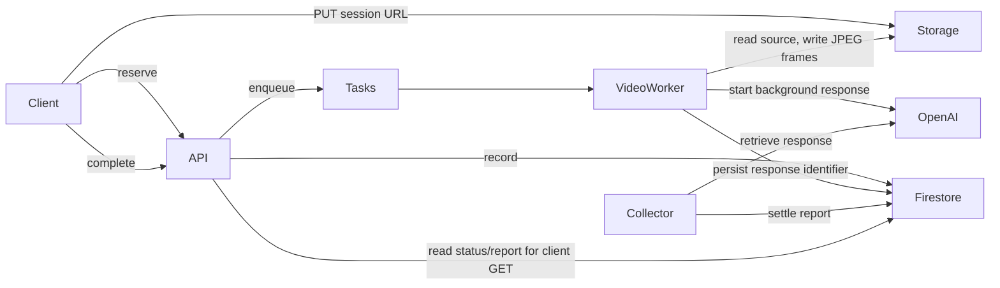

# Architecture implementation: services and durable state

The API authenticates a Firebase ID token and requires the literal
`agent: true` claim. It derives the owner key by hashing the verified UID.
The caller cannot choose another owner for Agent routes.
Admin reads separately require `admin: true`; the claims are independent.

## Video pipeline

Only server components access Firestore; OpenAI never connects to it.
The server persists the response identifier returned by OpenAI.
The original video goes to Storage, not directly to OpenAI. FFmpeg extracts
representative JPEG frames; one multi-image request carries their timestamps.
The video prompt treats them as one shelf scan and requests deduplication.

Records live under `agentAnalyses/{ownerKey}/analyses/{analysisId}`.
Source evidence is private. Frame paths include the current video attempt ID.
Normal video states: uploading → processing → uploaded → analyzing → analyzed.
The uploaded state is an intermediate preparation result, possibly too brief to see.
Failure and cancellation are separate terminal outcomes.

Provider response IDs, task identities and session URIs stay server-side except
the temporary upload URI intentionally returned to the uploader.
Collector tasks retrieve provider status; a one-minute reconciler dispatches
overdue analysis collection. It is not a general stalled-upload/video sweeper.
Background work continues without the page. GET polling only displays its state.
Video attempt/status checks and provider run IDs fence late settlement writes.
Cancellation persists before best-effort external cleanup; see the gap register.

API: Toronto, `northamerica-northeast2`.
Video/collector/scheduler: Montréal, `northamerica-northeast1`.
Source: [Firebase composition](../../../server/src/firebase.js),
[runner](../../../server/src/agent-analysis-runner.js),
[store](../../../server/src/agent-analysis-store.js).
