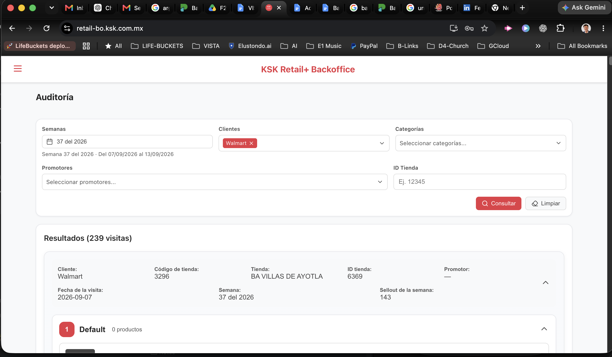
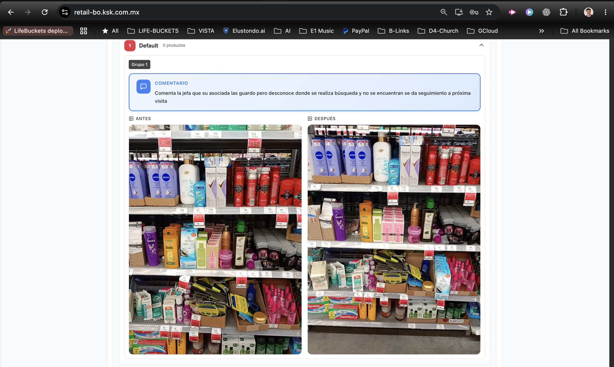
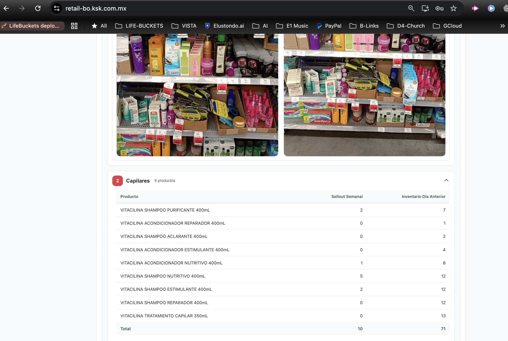
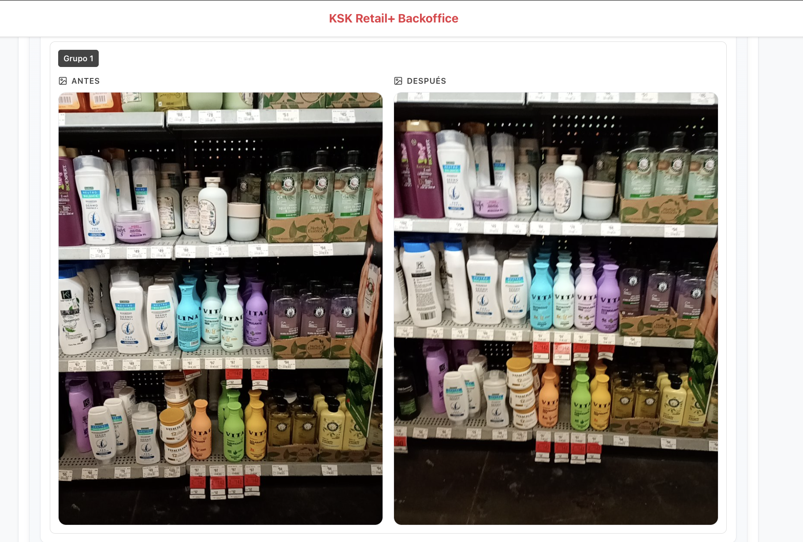
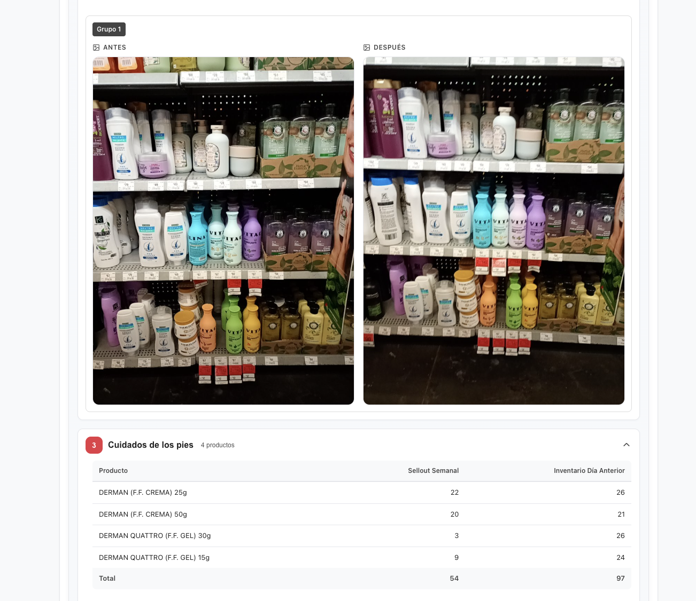

# What the screenshots show

## 1. Audit search and visit context

The Auditoría page filters by week, client, category, promoter and store ID.
The example selects Walmart and week 37 of 2026, showing 239 visits.
One expanded visit shows store code 3296, store ID 6369, visit date 2026-09-07,
store BA VILLAS DE AYOTLA and weekly sellout 143. The promoter is shown as a dash.
Store code and store ID are separate displayed fields; do not merge them.

## 2. Evidence, comments and before/after views

The Default category shows “0 productos” but still contains a comment and photos.
This does not mean no products are visible or that YOLO detected zero objects.
The comment describes an unsuccessful search and follow-up at a later visit.
Images are labeled ANTES and DESPUÉS. Their exact relationship to inspector actions,
automated recognition and manual correction is not established by these labels.

## 3. Category rows and business measures

Capilares shows nine named Vitacilina product rows. Columns are Producto,
Sellout Semanal and Inventario Día Anterior; displayed totals are 10 and 71.
These columns are not labeled detected units, visible facings or human-corrected counts.
Do not compare their totals directly with AI Shop's reported shelf counts.

## 4. Another before/after pair

The pair contains multiple brands, including visible Vitacilina packaging.
The camera view and shelf arrangement differ. We cannot attribute each difference
to an inspector action, nor infer exact product identity/count from this screenshot alone.

## 5. Foot-care category

Cuidados de los pies has four Derman rows: creams 25g/50g and Quattro gels 30g/15g.
Displayed weekly sellout totals 54; prior-day inventory totals 97.
The repeated hair-care imagery above the table does not prove the Derman products
are present in those photos. Category-to-photo association must be confirmed.
Images 4 and 5 appear to repeat the same pair at different scales, not separate cases.
