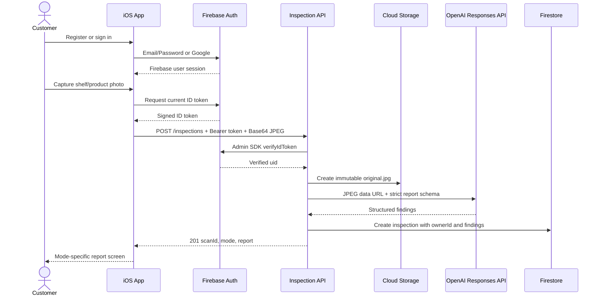

# Architecture and Sequence

HumanReviewerInitials: PME

## Components

## Trust boundaries

- The client never sends `ownerId`; the server derives it from the verified token `uid`.
- The client never holds the OpenAI API key or Firebase Admin credentials.
- The Cloud Function is publicly invokable at the network layer but every inspection submission requires a valid Firebase ID token.
- Original bytes are stored before analysis; model output is stored separately as immutable initial findings.
- Customer detail reads require matching `ownerId`; reviewer queue/evidence access requires `reviewer: true`.
