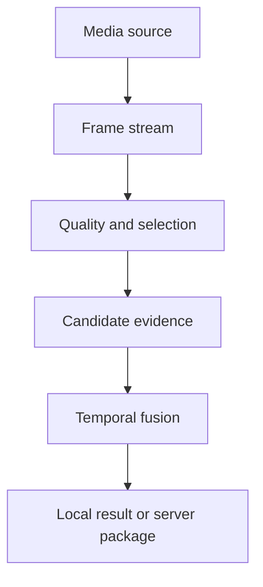

# AIShop iPhone App: High-Level Architecture

## Source-independent pipeline

`CameraFrameStream`, `VideoFixtureFrameStream`, and `ImageFixtureFrameStream`
implement the same timestamped-frame contract. Pipeline stages do not know which
source produced a frame.

## Fast and slow paths

The fast path performs quality, motion, coverage, lightweight detection,
tracking, and barcode probes for immediate guidance. The slow path consumes only
selected keyframes for OCR, visual embeddings, catalog matching, segmentation,
price association, and evidence fusion.

## Scheduling

- Bound every queue and prefer the newest eligible frame.
- Cancel or discard stale inference when newer evidence supersedes it.
- Run cheap gates frequently and expensive recognition selectively.
- Keep media timestamps through every stage for repeatability and explanation.
- Separate model adapters from orchestration so implementations can change.

## Handoff

When local evidence is insufficient, send bounded keyframes, crops, timestamps,
quality facts, candidate scores, and device/model versions. Avoid uploading the
entire video unless an explicit server workflow requires it.
