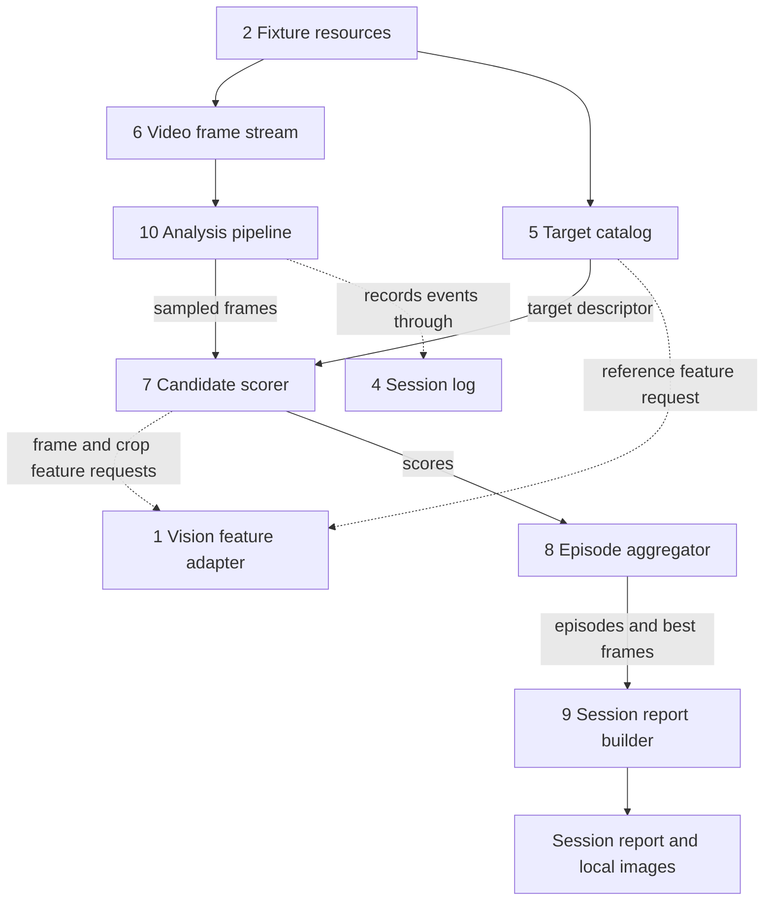
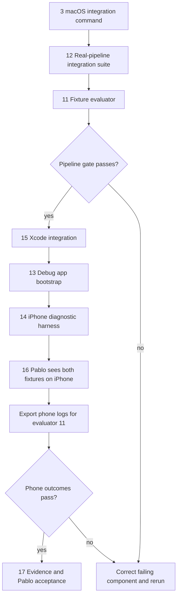

# Sprint 001 Component Anchor

Proposed revision of the [Sprint Plan Tasks](02-sprint-plan-tasks.md) anchor.
Numbers identify task ownership; diagrams flow downward for vertical reading.

The pipeline uses the same components on both hosts. Solid arrows carry data;
dotted arrows identify service dependencies. Images stay separate.

The macOS command does not launch the app. Automated app-shell E2E coverage
remains a recorded gap. Physical iPhone verification is required for acceptance.
