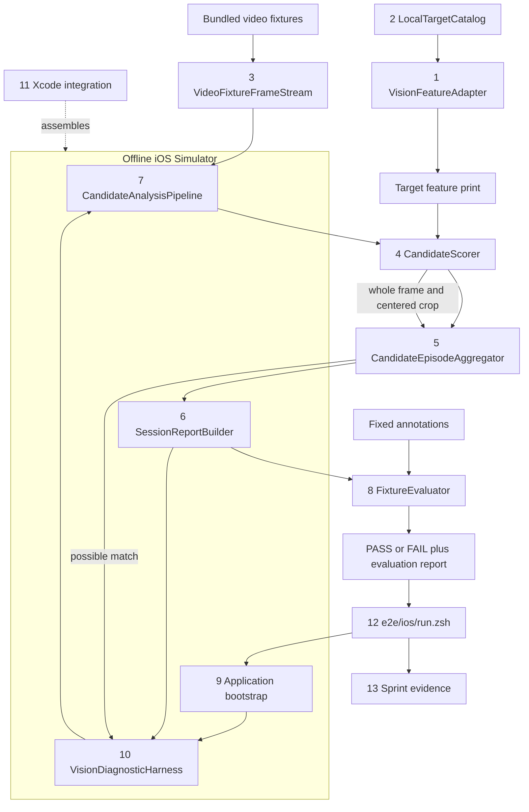

# Sprint 001 Component Anchor

This diagram anchors the components and evidence flow defined by the
[Sprint Plan Tasks](02-sprint-plan-tasks.md). Numbers identify task order.

Solid arrows are runtime or evidence flow. The dotted arrow is build-time
assembly. Firebase, authentication, camera, and network are outside this
debug-only fixture path; normal application startup remains unchanged.
