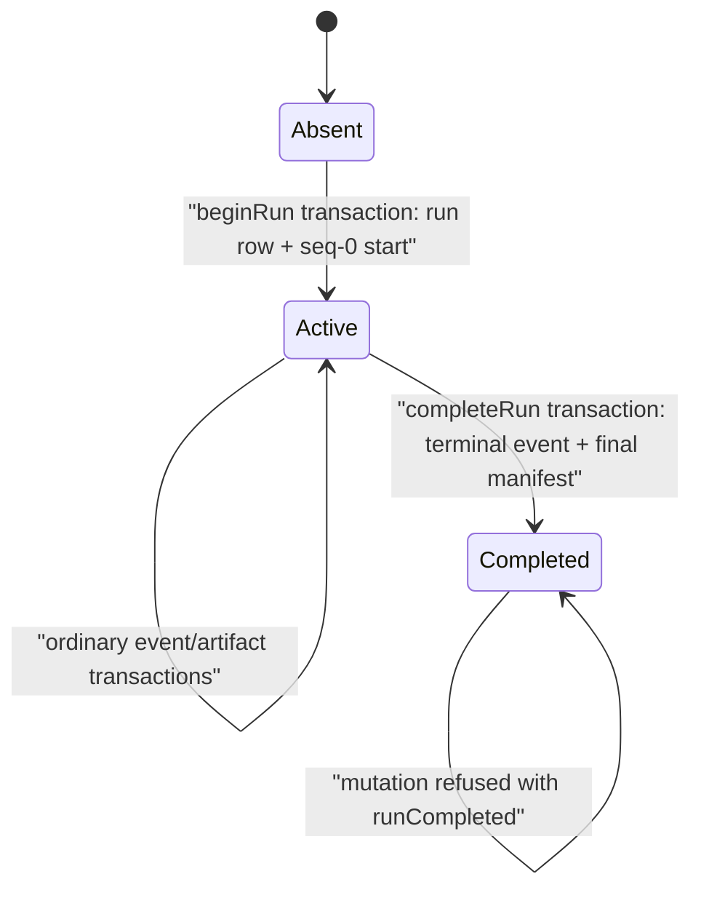

# C07 — Audit Evidence, Durable Storage & Reports

**Status:** Implemented foundation plus Sprint 8B merge-closure corrections, verified on an iOS simulator
**Scope:** C07 only  
**Schema:** `AuditSchema.version == 2`, additive fields only

## Responsibility and boundary

C07 owns the authoritative, offline audit flight record for a VISTA run. It
accepts structured event drafts, assigns event identity and a gapless per-run
sequence, records UTC and monotonic time, persists a hash-chained event
timeline, coordinates content-addressed artifact references, exposes
reconstruction/export, and makes persistence health visible.

C07 does not decide a capture, recognize a product, count a facing, determine a
business outcome, control a journey, or synchronize with a server. A producer
owns the truth of the operation, lifecycle stage, outcome, decision, and
failure it reports. C07 preserves that supplied truth; it must never invent a
replacement result when recording fails.

### C07 Audit Evidence, Durable Storage & Reports

- **Purpose and boundary:** Preserve one reconstructable, ordered, offline
  evidence timeline per run.
- **Primary responsibility:** Coordinate event and artifact durability while
  exposing integrity and persistence health.
- **Knows:** Active run identity/kind, immutable run versions, audit health,
  schema, event ordering, chain head, and artifact references.
- **Does / decides:** Starts and resumes runs; serializes producer writes;
  allocates durable order through the store; classifies its own persistence
  failures; degrades to the emergency journal; halts when both paths fail;
  reconstructs and exports timelines.
- **Protects / invariants:** One run ID per event, unique event IDs, gapless
  durable sequence, intact hash chain, atomic start, one terminal completion,
  immutable completed history and manifest, strict artifact metadata,
  external artifact bytes, bounded metadata-only payloads, and visible audit
  failure.
- **Explicitly does not own:** Capture policy, image analysis, recognition,
  facing counts, catalog matching, inspection/onboarding state, business-result
  creation, server sync, or final experiment-package UI.
- **Public contract:** `AuditRecording`, `EventDraft`, `AuditEvent`,
  `AuditOperationContext`, `AuditFailureInfo`, `ArtifactRef`,
  `StagedArtifact`, `AuditHealth`, `RunCompletionDisposition`, stable chain and
  artifact-resolution failures, and timeline export/retrieval.
- **Collaborators and direction:** A producer calls `AuditRecording`;
  `AuditRecorder` calls `AuditPersisting` and `EmergencyJournal`;
  `SQLiteAuditStore` calls SQLite and `ArtifactStaging`;
  a report/export caller reads reconstructed `ChainedEvent` values.
- **Inputs, outputs, and data owner:** Producers own draft semantics. C07 owns
  persisted audit records and artifact metadata. Artifact files remain external
  content-addressed evidence.
- **State and lifecycle:** The production store owns
  `absent → active → completed/sealed`. Atomic start creates the run and its
  sequence-zero start event together. Atomic completion appends the terminal
  event and stores its final manifest together. An unfinished persisted run
  may be resumed only after chain and run-head verification; completed state
  is immutable.
- **Failure, refusal, uncertainty, and recovery:** Store failure enters
  `degraded`; journal failure enters `halted`; malformed journal evidence
  returns a stable `JournalRecoveryFailureCode` without changing source bytes;
  malformed SQLite event, run, filename, or artifact rows return explicit
  `AuditStoreError` cases; incomplete legacy initialization and completed-run
  mutation fail explicitly; startup/load/completion failures propagate.
  Journal-recovery failures are classified (PR2 review fix, 2026-07-27):
  a failure that questions the journal's own integrity (unreadable, malformed,
  conflicting identity, concurrent source change) blocks new writes, while a
  failure that only means the store is currently unavailable preserves the
  backlog and journals the caller's new event behind it, so a sustained store
  outage keeps recording evidence in order until the journal itself fails or
  fills (→ `halted`, capture stops). Re-committing byte-identical evidence
  (same SHA-256) is idempotent, never degradation; a stored artifact row that
  contradicts re-committed bytes is explicit corruption. Launch-time recovery
  (`AuditStartup`) is per-run isolated: an unreadable or legacy-empty run is
  reported as a `StartupRecoveryFinding`, frozen byte-identical for review
  (owner decision, 2026-07-27), surfaced in the journey UI, recorded as
  `persistence.startupRunUnrecoverable` in the next run, and does not block
  new runs; only failure to enumerate runs at all stops recovery. Sprint 8B
  additionally rejects artifact references from the ordinary event/journal
  path, fails a primary artifact commit with
  `AuditError.artifactPersistenceFailed`, disables capture, and refuses
  completion while artifact state is unresolved. A metadata-only
  `persistence.artifactCommitFailed` marker preserves that refusal across
  restart without claiming a successful artifact reference. Resume restores
  all recorder state if its durable recovery transition fails. Chain, sequence, and stored
  run-head corruption return stable `AuditStoreError.corruptChain` codes
  before resume, extension, completion, or seal. Completion-store outage
  produces a warning terminal event with `completionPersistence ==
  journalDeferred`, never a normal-health terminal claim.
- **Concurrency assumptions:** `AuditRecorder` is the single actor coordinator.
  `SQLiteAuditStore` and its SQLite connection are confined to that actor.
- **Security and privacy:** The authoritative failure envelope contains stable
  domain/code/recoverability fields rather than raw database messages. Producers
  must not place secrets or unnecessary personal/store-sensitive data in
  payloads. C07 enforces flat scalar payload size/count bounds and rejects
  obvious embedded artifact content before either persistence path.
- **Audit and observability:** Every event carries schema, IDs, sequence, run,
  timestamps, versions, severity, privacy, retention, and optional structured
  context, decision, operation, failure, payload, and artifact references.
- **Tests:** Production `AuditRecorder`, `SQLiteAuditStore`, SQLite/WAL,
  serialization, chain materialization, artifact filesystem, journal,
  reconstruction, and exporters run against temporary directories.
- **Current limitations:** Simulator evidence is not power-loss or physical
  iPhone evidence. Journal replay is restart-safe and idempotent but is not an
  atomic filesystem/database transaction. Artifact-bearing operations are not
  replayed transactionally through that journal; they fail closed and require
  operator/retry handling. Chain verification is mandatory at mutation/seal
  boundaries but not yet on every non-mutating query/export. Payload bounds are enforced, but C07
  does not semantically redact otherwise valid producer metadata.
  `FileAuditStore` remains a reference/test substitute: it derives its
  completed manifest from immutable JSONL history and does not prove SQLite/WAL
  or physical durability.
- **Extension or replacement seam:** Future producers depend on
  `AuditRecording`; persistence remains behind `AuditPersisting`. No second
  logger, event bus, or store is required.

## Public contract

### Run lifecycle

- `beginRun(kind:versions:)` asks the store to create the run row and its
  truthful sequence-zero `session.runStarted` event in one transaction. The
  recorder becomes active only after that transition commits.
- `resumeRun(runID:)` loads the durable timeline and records
  `session.runRecovered` only when the run is unfinished and the complete
  chain agrees with the store's durable run head. Any failure restores the
  recorder's prior in-memory lifecycle state.
- `endRun(outcome:)` recovers journal evidence first, then performs one
  `completeRun` transition that appends `session.runCompleted` as the durable
  tail and stores the manifest derived from that final chain head and the
  deduplicated artifact hashes referenced by the run's own chain events (so
  evidence shared with another run is never omitted). If the store is
  unavailable, the terminal event closes the run inside the journal, behind
  any backlog, with degraded health and `journalDeferred`; replay completes it
  through the immutable transition. The returned `RunCompletionDisposition`
  distinguishes that deferred result from `primaryCommitted`.
- `timeline(runID:)` reconstructs a run without making it active.

`RunCompletionReceipt` exposes the terminal record and immutable manifest to
the completion caller/store contract. `sealRun(runID:)` is retained only as a
compatibility query: it returns an existing completed manifest and cannot
create, recompute, or replace one. The terminal event does not contain the
manifest, avoiding a circular event-hash dependency.



### Event envelope

Every `AuditEvent` has:

- schema version, event UUID, run UUID/kind, and gapless sequence;
- UTC and monotonic timestamps;
- category, dotted event name, actor, state/correlation/causation context;
- immutable run versions;
- optional decision, operation, and stable failure structures;
- bounded, flat JSON-safe scalar metadata;
- external artifact references;
- severity, privacy, and retention classification.

`AuditOperationContext` supplies component, operation, lifecycle stage, and
optional outcome. `AuditFailureInfo` supplies a stable domain, code, and
recoverability flag. Raw SQLite error strings are not copied into the
authoritative degraded event.

The new fields are additive and optional so persisted schema-v2 records created
before Sprint 7C remain decodable. New C07-staged artifact references contain
identity, media type, byte count, SHA-256, kind, and store-relative storage
location. Legacy callers of `stageArtifact(data:kind:)` receive
`application/octet-stream`; callers that know the media type use the explicit
overload. Explicit media types must be one nonblank RFC-style `type/subtype`
token pair with no whitespace or parameters.

### Metadata payload limits

`AuditPayloadPolicy` is applied by the recorder, chain materializer, and
emergency-journal serializer/decoder before content reaches SQLite or the
fallback journal:

| Dimension | Limit |
|---|---:|
| Payload keys | 32 |
| UTF-8 bytes per key | 64 |
| UTF-8 bytes per string value | 2,048 |
| Canonically encoded payload | 16 KiB |
| Nesting/collection depth | 0; the model supports only a flat scalar map |

Data URLs are rejected. Long syntactically valid Base64 values are rejected
when the key identifies artifact/blob/image bytes or the decoded bytes carry a
known image/document media signature. Stable `AuditPayloadViolation` cases do
not echo the rejected key or value.

## Durable event and artifact flow

```mermaid
sequenceDiagram
    participant P as "C07 producer"
    participant R as "AuditRecorder actor"
    participant S as "SQLiteAuditStore (WAL)"
    participant A as "ArtifactStaging"
    participant J as "EmergencyJournal"

    P->>R: "EventDraft / artifact bytes"
    opt "Artifact"
        R->>S: "stage(data, kind, mediaType)"
        S->>A: "atomic write, fsync, SHA-256"
        A-->>R: "StagedArtifact + relative reference"
    end
    R->>J: "snapshot backlog without clearing"
    opt "Backlog exists"
        R->>S: "compare/replay original typed IDs"
        R->>J: "acknowledge exact snapshot after all are durable"
    end
    R->>S: "append new pending event (+ staged artifacts)"
    S->>S: "allocate seq + insert record + update chain head"
    alt "SQLite succeeds"
        S-->>R: "ChainedEvent"
        R-->>P: "AuditEvent"
    else "SQLite fails for event-only write"
        R->>J: "structured degraded marker + pending event"
        alt "Journal succeeds"
            R-->>P: "sentinel-sequence AuditEvent; health = degraded"
        else "Journal fails"
            R-->>P: "AuditError.auditHalted; captureAllowed = false"
        end
    else "Artifact-bearing commit fails"
        R-->>P: "typed artifactPersistenceFailed; no journal success; captureAllowed = false"
    end
```

SQLite sequence allocation, event insertion, and chain-head update occur in
one database transaction. Artifact promotion occurs before the event/metadata
transaction: a crash may leave an orphan file, which startup reconciliation
reports/quarantines; C07 does not claim filesystem and SQLite atomicity. A
pre-existing content-addressed destination is accepted only after byte-count
and SHA-256 verification. A conflicting destination preserves the valid staged
copy in staging or quarantine and fails explicitly.

Run initialization and run completion have stronger database boundaries.
Initialization inserts the run row and materializes `session.runStarted` at
sequence zero in one SQLite transaction. Completion verifies active state,
the full chain, the stored run head, and every referenced artifact's registry
row and bytes, then
appends exactly one final `session.runCompleted`, strictly decodes every
artifact row, computes
`SHA256("manifest:" + finalChainHead + ":" + sortedArtifactHashes)`, and stores
the manifest in immutable run metadata in one SQLite transaction. A failure at
either transition rolls back the entire database transition.

When SQLite becomes writable after degraded operation, the recorder first
snapshots and validates every JSONL record as `PendingAuditEvent`, scans the
durable store by original event ID, replays missing original typed events, and
skips already durable semantically equivalent events. A duplicate ID with
different semantic content is explicit corruption. Only after the complete
snapshot is confirmed durable does the journal atomically replace that exact
source with an empty acknowledged file. This keeps `session.runCompleted` as
the durable tail used by startup recovery.

A journaled terminal request replays through `completeRun`, never through an
ordinary append. A new or conflicting journal request against a completed run
is refused and remains recoverable. A semantically equivalent event ID already
present in durable history remains the established idempotent success case.

Recovery runs before any newly requested event is appended. If recovery fails,
the new request is not durable and returns failure; a caller is never told that
its new request failed after C07 already appended it.

## Failure and recovery behavior

| Condition | Observable behavior | Business-result authority |
|---|---|---|
| SQLite write fails, journal works | `health == .degraded`; stable structured failure marker; event receives sentinel sequence | Unchanged; C07 records only |
| SQLite later works | Original typed journal events replay by original event ID; exact source is acknowledged only after full durable replay | Unchanged |
| Equivalent ID is already durable | Replay skips it idempotently | No duplicate event |
| Same ID has conflicting content | Stable `conflictingEventID` recovery failure; source bytes remain | No ambiguous overwrite |
| Journal JSON/UTF-8/final line/record is malformed | Stable recovery failure with record position where available; source bytes remain | No lossy decoding or silent empty recovery |
| Replay or final acknowledgement fails | Failure is explicit; source remains at tested injection boundaries; already durable equivalent IDs are skipped on restart | No invalidation of accepted events |
| SQLite and journal both fail | `AuditError.auditHalted`; `captureAllowed == false`; no event/result returned | C07 cannot create a fallback result |
| Artifact-bearing primary commit fails | Typed `artifactPersistenceFailed`; staged/promoted bytes are preserved where possible; the journal receives only a metadata-only failure marker; capture and seal are refused across restart | No authoritative orphan reference |
| Ordinary event attempts to carry an artifact reference | Typed refusal requiring the staged-commit API; no store or journal mutation | No bypass of artifact durability |
| Chain, sequence, or stored run head is corrupt | Stable `corruptChain` code; resume/extension/completion/seal refuses without repair | Affected history is frozen |
| Resume transition fails after actor activation | Recorder state is restored; later healthy recovery and new runs remain possible | No poisoned active recorder |
| Completion store write is deferred | Warning terminal journal entry reports degraded health and `journalDeferred`; no normal sealed terminal exists until truthful replay | Caller can distinguish committed from deferred |
| Stored event JSON or run ID is malformed | `AuditStoreError.corruptRecord(line:)` or `corruptRunID(row:)` | No silent omission or reconstruction |
| Artifact row has a wrong storage class/value/reference | `AuditStoreError.corruptArtifact(row:column:)`; completion and reconciliation stop before using a partial set | Raw row remains available for diagnosis |
| Legacy run row has no start event | `AuditStoreError.incompleteRunInitialization(runID)` | No synthesized event, version, timestamp, result, or seal |
| Payload or media type violates policy | Stable validation error before SQLite/journal/artifact file write | No oversized metadata or ambiguous media metadata |
| Startup enumeration/load fails | Error propagates from `AuditStartup` | No silent “nothing to recover” claim |
| Store or recorder mutates a completed run | `AuditStoreError.runCompleted(runID)` at the persistence boundary, surfaced as the applicable recorder/recovery error | No post-completion event, artifact promotion, sequence, chain-head, or manifest change |
| Completion is attempted through ordinary append | `AuditStoreError.completionRequiresAtomicTransition` | No pre-terminal or independently sealed state |
| Staged/promoted artifact interrupted | Reconciliation reports staged/orphan/missing/corrupt/unreadable evidence plus enumeration or quarantine-move failures | No fabricated quarantine or artifact success |

The emergency journal remains bounded at 5 MiB. Snapshot and SQLite replay are
not one atomic transaction; restart safety instead comes from preserving the
source through replay and comparing original event IDs before retry. A crash
before acknowledgement leaves the full source. A crash after acknowledgement
finds an empty source only after all snapshot entries were durably accepted.

## Declared unit and reality-contact testing

The declared unit under test is **C07’s production audit/observability
module**. Sprint 7C tests execute the production recorder, envelope,
serialization, chain materializer/verifier, SQLite/WAL store, artifact staging,
filesystem, emergency journal, startup recovery, reconstruction, and exporter.

Only nondeterministic boundaries outside C07 are controlled. `FixedClock`
supplies deterministic UTC/monotonic values, and temporary directories isolate
test evidence. A real second SQLite connection holds an exclusive lock to
exercise the production failure path. The correction tests use a narrow
append-failure wrapper and a recorder checkpoint hook only to stop at precise
replay/acknowledgement boundaries; production serialization, journal parsing,
SQLite/WAL, chain materialization, restart, and at least one real-lock recovery
path remain under test.

`C07IntegrityClosureTests` additionally uses raw SQL only to seed malformed
durable rows and temporary triggers at exact transaction boundaries. The
assertions still execute the production `SQLiteAuditStore`, recorder, journal,
filesystem staging, strict decoder, rollback, reopening, and reference-store
paths.

`Sprint8BC07MergeClosureTests` covers artifact commit failure, ordinary-journal
artifact refusal, unresolved-reference prevention, all four chain/run-head
corruption classes, rollback-safe resume and later recovery, truthful
reconciliation failures, corrupt-destination preservation, deferred
completion, and seal-time verification.

## What Sprint 7C and Sprint 7C2 prove

- A completed run can be reconstructed by a fresh recorder/store.
- Concurrent calls through the production actor produce no lost event,
  duplicate event ID, sequence gap, or broken chain.
- Required structured operation/failure and artifact-reference fields survive
  real serialization and reconstruction.
- Completed-run writes/resume are explicitly refused.
- Run creation plus sequence-zero start, and terminal-event plus final-manifest
  completion, each commit or roll back as one SQLite transition.
- The immutable manifest binds the final chain head without embedding itself
  in the terminal event.
- Direct append, artifact append, journal replay, second completion, and
  reseal paths cannot extend or replace completed state.
- Every persisted artifact column is decoded strictly for both completion and
  reconciliation; malformed rows are located by row and column and remain
  untouched.
- Legacy empty runs and reference-store corruption are explicit rather than
  silently repaired or omitted.
- SQLite lock, journal recovery, dual-path failure, malformed rows, and
  unreadable-journal recovery, and completion ordering are observable.
- Original journaled event IDs and structured fields survive replay.
- Malformed source bytes, partial replay, equivalent/conflicting duplicates,
  final acknowledgement, and second-restart idempotency have explicit tests.
- Payload limits, embedded-artifact rejection, media-type shape, and malformed
  durable run IDs are enforced and tested at positive/negative boundaries.
- JSON export preserves durable order, correlation, and chain integrity.
- The full simulator unit-test suite remains green.
- Artifact-bearing writes cannot claim success through the ordinary journal
  and unresolved evidence prevents completion.
- Resume, extension, completion, and seal freeze previous-hash, chain-hash,
  sequence, and stored run-head corruption without repair.
- Failed resume does not poison later run recovery.
- Reconciliation and deferred completion outcomes are explicit rather than
  false success.

## What Sprint 7C does not prove

- C01 capture or C06 recognition instrumentation.
- Live camera-to-recognition-to-audit integration.
- A physical iPhone kill, power-loss, thermal, latency, or filesystem-pressure
  experiment.
- Server synchronization, upload, remote audit, or final report-package UI.
- Semantic redaction of otherwise valid producer metadata.
- Atomic commitment across SQLite and the artifact filesystem.
- Transactional replay of artifact-bearing journal operations.
- Chain verification on every non-mutating read and export.
- Recognition or facing-count accuracy.

## Future C01 and C06 consumption

A later approved sprint may inject the existing `AuditRecording` contract into
C01 or C06 and submit domain-owned `EventDraft` values at their real decision
boundaries. Those producers must supply truthful component/operation/stage/
outcome, correlation/causation, version, decision, confidence/abstention, and
artifact references as applicable. They must continue returning their own
business results; an audit success or failure may gate an approved operation
but may never synthesize recognition or capture output.

Sprint 7C intentionally adds no such integration.
