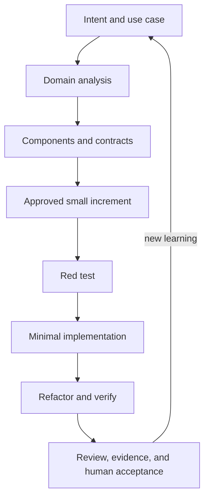

# VISTA Repository Operating Contract

This file is the canonical operating contract for coding agents working in this
repository. It applies to the whole repository unless a more specific
`AGENTS.md` exists in a descendant directory.

It governs how agents analyze, design, implement, test, review, document, and
hand off repository work. It does not replace VISTA's product specifications,
the Personal Agent System's VISTA definition/context, or the runtime
components described by the product.

**Project owner and final decision authority: Pablo Elustondo.**

## 1. Start with context, not code

Before changing anything:

1. Read this file completely.
2. Confirm the task mode: explain, review, diagnose, design, implement, or
   release. A request to review or diagnose does not authorize a fix.
3. Inspect the current branch, commit, and worktree. Preserve all unrelated
   user changes and untracked files.
4. When connected project context is available, open the
   [Personal Agent System Registry](https://docs.google.com/document/d/1mQm9Gs20KG5Gh0_kJOWuO38sfAf2SfOrJNZlKpI0r0s)
   to confirm routing to VISTA. The Registry routes context; it does not grant
   implementation authority. If it is unavailable, state that and continue
   from the repository's canonical index.
5. Open the canonical documentation index:
   `docs/00_start_here/00-vista-documentation-index-and-canonical-reading-order.md`.
6. Read, at minimum, the documents relevant to the work:
   - `docs/01_current_state/vista-executive-review-brief.md`
   - `docs/01_current_state/vista-comprehensive-documentation-and-code-review.md`
   - `docs/02_product_contract/vista-use-cases-sequences-and-system-context.md`
   - `docs/03_engineering_governance/vista-mandatory-architecture-and-development-rules-solid-2.0-responsibility-driven-design.md`
   - `docs/03_engineering_governance/vista-architecture-component-responsibility-and-code-documentation-specification.md`
   - `docs/03_engineering_governance/vista-testability-dependency-injection-and-verification-specification.md`
   - `docs/03_engineering_governance/vista-observability-audit-trail-and-logging-specification.md`
   - the current approved sprint, ADRs, tests, fixtures, and evidence for the
     affected component
7. For recognition and facing-count work, also read:
   - `docs/05_testing_and_evidence/vista-human-readable-test-set-001-ogx-catalog-and-facing-counts.md`
   - `docs/10_additional_context/vista-product-facing-recognition-and-counting-module-dossier.md`
   - `VistaTests/RecognitionCounting/README.md`

Useful preflight commands include:

```bash
git status --short --branch
git rev-parse --show-toplevel
git log -1 --oneline
xcodebuild -list -project Vista.xcodeproj
```

Do not assume a scheme, simulator, signing configuration, model, threshold, or
test baseline. Discover the repository's current configuration and report the
one actually used.

## 2. Authority and truth

`AGENTS.md` operationalizes the canonical project documents; it cannot
supersede them.

Use the documentation index to resolve the currently approved documents.
Conceptually, authority descends in this order:

1. Pablo's explicit current decisions and immutable approved source
   specifications.
2. Mandatory engineering-governance rules.
3. Canonical product, architecture, component, testability, and observability
   specifications.
4. Approved ADRs and decision records.
5. The approved sprint or implementation plan.
6. Code, tests, logs, and artifacts as evidence of current implementation.
7. Reviews, handoffs, screenshots, communications, experiments, vendor
   research, and historical documents as context.

The repository shows what exists. It does not silently redefine what the
product is intended to do. A filename, passing test, screenshot, modification
date, commit message, or prior agent claim does not by itself establish
authority or maturity.

When sources disagree:

- state the contradiction and cite both sources;
- classify claims as **confirmed**, **inferred**, **proposed**, or
  **unresolved** when that distinction matters;
- do not choose by recency, convenience, or apparent completeness;
- stop before the disputed design or implementation decision;
- request Pablo's decision or propose an ADR.

Never manufacture a missing requirement, product fact, confidence value,
count, price, success state, or source of authority.

## 3. Product invariants

Preserve these invariants unless Pablo approves a documented change:

- KAM Onboarding and Inspector Inspection are separate journeys and separate
  runs, connected by a versioned Onboarding Profile.
- Store identity is explicit. GPS may support identity; it is never sole proof.
- Completion depends on sufficient evidence, coverage, and quality—not a
  fixed number of photos.
- Capture, guidance, local results, and authoritative device history must work
  offline for the critical visit path.
- Synchronization and server analysis add separate evidence. They do not
  overwrite original local history or silently replace a local result.
- Closed-catalog recognition supports `UNKNOWN`, unreadable, partial, and
  low-confidence outcomes.
- Poor capture produces an explicit quality failure, retake, partial result,
  or uncertainty. It never produces fabricated success.
- Simulated, mocked, fixture-driven, and placeholder output is unmistakably
  labeled. `LOCAL` means genuinely processed on the device.
- Human review can accept, reject, correct, mark unreadable, or request a
  rescan while preserving original values and evidence.
- A run must be reconstructable from observation through decision, guidance,
  movement, capture, artifact, coverage, result, review, and synchronization.
- Recognition contracts remain runtime-neutral until benchmark evidence and
  an approved decision select an implementation.

Do not introduce web/server dependence, a vendor SDK, model conversion, custom
training, licensing obligations, planograms, prices, dashboards, or commercial
integrations unless the approved scope requires them.

## 4. The development loop and its gates

VISTA uses small, evidence-producing vertical increments:



Do not collapse specification, architecture, implementation, and acceptance
into one improvisational coding pass.

### A change is non-trivial when it affects

- product behavior or acceptance criteria;
- a component's responsibility, public contract, collaborators, or authority;
- state, persistence, synchronization, concurrency, or lifecycle;
- capture, quality, guidance, recognition, catalog matching, counting, review,
  or audit behavior;
- dependency direction, composition, project targets, packages, models,
  fixtures, baselines, or external integrations.

Before coding a non-trivial change, present a concise design gate containing:

1. intent, use case, and acceptance criteria;
2. scope and explicit non-goals;
3. relevant domain vocabulary, rules, and invariants;
4. proposed components and Component–Responsibilities–Collaborators cards;
5. interfaces, dependency direction, data flow, state ownership, decision
   authority, and side-effect boundaries;
6. failure, refusal, timeout, offline, unknown, and low-confidence behavior;
7. a test-first plan;
8. observability and evidence requirements;
9. documentation, Mermaid, and ADR impact;
10. assumptions, risks, and decisions still needed.

Coding begins after that proposal is reviewed, or when the request already
provides a traceable approved design and bounded scope. A new builder that
cannot find such authorization stops after preflight and asks.

An exploratory spike requires explicit authorization, a time box, a question
to answer, isolated output, and an agreement about what will be discarded or
promoted. A spike is not production completion.

Approval is scope-specific. It does not authorize adjacent refactoring, new
dependencies, branch changes, runtime/model selection, baseline rewrites, or
architecture drift.

## 5. Responsibility-driven components

Begin with domain responsibilities, not frameworks, screens, files,
protocols, services, or fashionable patterns.

Every significant component has one coherent purpose and one primary reason to
change. Document a CRC card before introducing or materially changing it:

```markdown
### <Domain component name>
- Purpose and boundary:
- Primary responsibility:
- Knows:
- Does / decides:
- Protects / invariants:
- Explicitly does not own:
- Public contract:
- Collaborators and direction:
- Inputs, outputs, and data owner:
- State and lifecycle:
- Failure, refusal, uncertainty, and recovery:
- Concurrency assumptions:
- Security and privacy:
- Audit and observability:
- Tests:
- Current limitations:
- Extension or replacement seam:
```

For every collaboration, make the caller, callee, request/response contract,
state owner, error semantics, timeout/cancellation behavior, decision
authority, and evidence produced explicit.

Capture quality, capture execution, guidance, recognition, catalog matching,
inspection analysis, facing counting, reporting/review, persistence,
synchronization, audit, and benchmarking are distinct responsibilities. A
bounded increment may implement only some of them; it must not erase their
boundaries or collapse them into a view, controller, camera adapter, or
universal recognition object.

Use precise domain names. Avoid vague names such as `Manager`, `Helper`,
`Utility`, `Processor`, `Engine`, `Handler`, or `Service` unless the name
communicates a genuinely precise responsibility in context.

Keep:

- domain decisions and state machines independent of SwiftUI, AVFoundation,
  Vision, Core ML, persistence, networking, and vendor code;
- UI responsible for presentation and user interaction, not domain policy;
- framework calls and side effects at visible adapters/boundaries;
- dependencies explicit and injected;
- live and replay composition behind the same production decision logic;
- state ownership and concurrency semantics explicit.

Do not create hidden globals, convenience singletons, service locators,
oversized protocols, god objects, or universal agents.

## 6. SOLID is an executable constraint

Classical SOLID applies pragmatically:

- **Single Responsibility:** one coherent responsibility and reason to change.
- **Open/Closed:** extend only through real, stable seams; never use extension
  points as an excuse for drift or speculative abstraction.
- **Liskov Substitution:** real, fake, replay, local, server, and future
  implementations preserve the semantic meaning of results, confidence,
  errors, lifecycle, and cancellation.
- **Interface Segregation:** contracts are narrow and shaped around actual
  collaborators; no god protocols.
- **Dependency Inversion:** domain policy depends on stable domain contracts,
  while volatile frameworks and infrastructure depend inward through
  adapters.

VISTA's agentic interpretation adds **limited authority**: a component or
coding agent may decide only what its approved responsibility permits. It
must escalate decisions outside that boundary and expose enough evidence to
review what it decided.

Inject behavior-affecting dependencies such as camera/frame source, capture,
motion, clock, location, connectivity, persistence, recognition/model
execution, catalog access, synchronization, policies, and external services.

Do not add an interface or type merely because a noun exists. Add an
abstraction only for real substitutability, deterministic testing, volatility
isolation, authority control, or protection of the domain.

## 7. TDD and verification

For every behavioral change, follow Red → Green → Refactor:

1. Add or identify the smallest failing behavioral test.
2. Run it and confirm it fails for the expected reason.
3. Implement the smallest coherent change that satisfies the contract.
4. Run the focused test until green.
5. Refactor without changing contract semantics.
6. Run the relevant component, integration, regression, UI, offline, replay,
   and broader suites.
7. Record exact commands, environment/destination, pass/fail/skip counts, and
   limitations.

If a behavior cannot yet be automated, define the acceptance evidence,
fixture, expected result, and human verification procedure before
implementation. “Test later” is not a plan.

Testing rules:

- Test components independently and test their meaningful seams together.
- Prefer negative-first cases: floor, door, wrong shelf, blur, movement,
  distance, glare, off-target regions, duplicates, incomplete coverage,
  offline operation, failed persistence, and failed synchronization.
- A forbidden automatic capture is an immediate failure.
- Production and replay use the same reducer, quality gates, matcher, coverage
  logic, and capture decisions.
- The viewport evidence shown to the user is the evidence analyzed.
- Tests control time, frame order, motion, location, and connectivity.
- Preserve meaningful failure, uncertainty, refusal, retry, and recovery paths.
- Use the appropriate layers: pure unit, image regression, deterministic
  scenario replay, UI, offline/synchronization, physical iPhone, and realistic
  shelf/field validation.
- Device and field tests remain necessary for focus, thermals, latency,
  ergonomics, motion, and real-store reliability.

Ground-truth fixtures and accepted baselines are versioned evidence. Never
weaken assertions, relabel a fixture, change expected counts, alter thresholds,
remove failure cases, or regenerate golden logs merely to obtain green tests.
Any legitimate baseline change needs a rationale, reviewer, and new version.

Report real image-backed, fixture-only, simulated, mocked, skipped, and
unavailable checks separately. Compilation, a placeholder response, an
unexercised implementation, and a passing stub are not proof of behavior.

## 8. Observability and auditability

Observability is product behavior, not optional debug output.

Distinguish:

- authoritative audit events;
- evidence telemetry;
- evidence artifacts;
- operational diagnostics.

Use typed, versioned, machine-readable events. Where applicable, include:

- run ID, event ID, ordered sequence, UTC time, and monotonic time;
- actor, previous/current state, correlation, and causation;
- app, model/runtime, catalog, profile, policy, and configuration versions;
- input/evidence references and hashes;
- decision, reason, threshold, output, confidence/abstention;
- retry, cancellation, refusal, and error details;
- processing time;
- human correction and final disposition;
- privacy and retention classification.

Every guidance instruction, capture, coverage update, recognition result,
correction, retry, and synchronization action must link causally to its
evidence. The authoritative local audit works offline, survives restart, and
preserves original history. Server-side evidence is additive.

Logging failure must be visible and follow the approved integrity policy.
Critical audit or persistence errors are never silently ignored. Do not claim
filesystem and database changes are atomically committed unless the actual
protocol proves it; document staged writes, hashes, commits, and
reconciliation truthfully.

Test event schemas and golden audit timelines. Redact secrets and unnecessary
personal or store-sensitive data. Metrics require documented event sources,
definitions, units, and denominators.

## 9. Documentation is part of the implementation

Update documentation in the same increment as the behavior or architecture it
describes. Maintain, as applicable:

- architecture overview;
- component CRC cards;
- interface and semantic-contract documentation;
- algorithm notes, coordinate systems, units, thresholds, and confidence
  semantics;
- ADRs for significant structure, technology, model/runtime, policy, and
  approved exceptions;
- test strategy, fixtures, ground truth, and evidence;
- observability event/schema documentation;
- known limitations, placeholders, deferred work, and technical debt;
- the documentation manifest, directory map, and canonical index when their
  contents or status truly change.

Do not reorganize, rename, move, delete, promote, or supersede documents merely
because an inconsistency is discovered. Report it and obtain approval.

### Repository-first artifact delivery

Every durable VISTA engineering artifact must be stored in this repository.
A chat response, temporary sandbox file, Downloads file, Google Doc, external
Drive file, private agent session, or generated image is not a complete durable
delivery by itself.

This rule includes:

- Markdown documentation, code onboarding, analysis, plans, ADRs, runbooks,
  prompts, sprint reports, and review reports;
- UML, CRC, component, sequence, state, and deployment diagrams;
- editable diagram sources such as PlantUML (`.puml`) or Mermaid (`.mmd`), plus
  rendered PNG or SVG output;
- CSV, JSON, catalogs, manifests, fixtures, ground truth, and benchmark data;
- test evidence, exact commands, logs, and reproducibility notes;
- agent instruction files such as `AGENTS.md`, `CLAUDE.md`, and approved
  tool-specific adapters;
- images and other artifacts required to reproduce, explain, review, or
  continue the work.

Before ending an artifact-producing task, place the files in an appropriate
repository path, use relative links, update the local index or manifest when
needed, and report exact paths plus `git status` and `git diff --stat`. Do not
stage, commit, push, or open a pull request without explicit authorization.

For maintainable diagrams, preserve all three:

```text
editable source
    +
rendered image
    +
Markdown explanation
```

PlantUML and Mermaid are preferred source formats. A rendered image without an
editable source requires a documented exception.

### Mermaid

Use Mermaid in Markdown when a visual materially clarifies:

- component ownership and dependency direction;
- production-versus-replay composition;
- important use-case sequences;
- state machines, retries, and recovery flows.

Diagrams must use the same domain vocabulary and component names as the code,
show direction and ownership, and distinguish **proposed** from
**implemented** architecture. Update affected diagrams in the same change.
Never draw a component, flow, runtime, or maturity level that the repository
does not actually contain.

Prefer a small precise diagram over a decorative one. Do not use diagrams to
hide missing contracts or unresolved decisions.

Code comments explain domain meaning, invariants, non-obvious rationale,
units, thresholds, confidence semantics, concurrency, lifecycle, recovery, and
privacy boundaries. Do not narrate obvious syntax.

## 10. Code-review contract

When asked for review, inspect and report before editing. Findings come first,
ordered by impact, with exact file/line evidence and a concrete failure mode.
Do not invent issues to fill a template.

A non-trivial increment requires architecture-conformance and code review
before human acceptance. Review:

1. use-case correctness and preserved domain meaning;
2. cohesive responsibilities and explicit non-responsibilities;
3. small contracts and correct dependency direction;
4. bounded decision authority and visible side effects;
5. state ownership, lifecycle, cancellation, and concurrency assumptions;
6. offline behavior and preservation of original local evidence;
7. real failure, unknown, low-confidence, retry, and recovery behavior;
8. meaningful tests, especially negative paths;
9. sufficient structured runtime/audit evidence;
10. privacy, security, and secret handling;
11. current component, contract, algorithm, and Mermaid documentation;
12. honest classification of production, prototype, mock, placeholder,
    partial, and deferred behavior;
13. ADRs for structural decisions and exceptions;
14. scope discipline and absence of opportunistic refactors.

Severity:

- **Blocker:** can corrupt evidence, invent success, violate a product
  invariant, leak sensitive data, break the critical offline path, or makes
  acceptance evidence invalid.
- **Major:** likely behavioral defect, contract violation, architectural drift,
  missing meaningful test/audit evidence, or material maintainability risk.
- **Minor:** localized clarity or robustness issue with low immediate risk.

An agent may perform a self-check, but it may not self-approve an exception or
replace required human acceptance.

## 11. Git, branches, sprints, and scope

- Work on the current authorized branch and bounded increment.
- Inspect status before and after edits.
- Preserve unrelated tracked and untracked work.
- Do not switch or create branches, merge, rebase, reset, stash, rewrite
  history, commit, push, open a PR, or alter remotes unless explicitly asked.
- Never use destructive cleanup to make the worktree look clean.
- Do not mix opportunistic refactors or formatting churn with the requested
  outcome.
- Do not add packages, models, targets, capabilities, signing changes, build
  settings, generated scaffolding, or network dependencies without approval.
- Keep commits focused when a commit is requested. A commit message, sprint
  number, or green build is not completion evidence.
- Never commit credentials, secrets, private catalogs, customer data, or
  sensitive raw evidence.

If a command cannot run because of the environment, report the limitation and
the exact check that remains. Do not alter project settings or tests merely to
make the local environment pass.

## 12. Definition of Done

An increment is done only when:

- it maps to an approved use case, requirement, or constraint;
- acceptance criteria and non-goals are satisfied;
- domain terms remain consistent;
- component responsibilities and non-responsibilities are explicit;
- contracts are small, semantic, and testable;
- dependencies, authority, state ownership, and side effects are explicit;
- a failing test or predeclared acceptance check preceded the behavior change;
- focused and applicable broader tests have recorded results;
- failure, offline, uncertainty, and negative paths are verified;
- runtime/audit evidence can reconstruct the relevant decisions;
- production, simulated, mocked, placeholder, partial, and deferred behavior
  are labeled honestly;
- architecture, component, contract, algorithm, test, observability, ADR, and
  Mermaid documentation is current where affected;
- architecture-conformance and code review found no unresolved blocker;
- known limitations, risks, and technical debt are recorded;
- a human explicitly accepts the increment when acceptance is required.

“It compiles,” “tests pass,” “the class exists,” and “the screen looks right”
are necessary evidence in some contexts, never sufficient definitions of
completion.

## 13. Required handoff

Every implementation handoff states:

- approved scope, non-goals, and use-case traceability;
- branch and exact commit/worktree used for evidence;
- components, responsibilities, contracts, and files changed;
- the test added first and why it initially failed;
- exact test/build commands and observed pass/fail/skip results;
- runtime/audit evidence and fixture IDs;
- documentation, Mermaid diagrams, and ADRs updated;
- production versus simulated/mocked/placeholder/deferred behavior;
- known limitations, unresolved questions, risks, and technical debt;
- architecture-conformance review result;
- recommendation: **accept**, **accept with conditions**, or **reject**;
- exact next action.

Separate facts from interpretations. If a test, simulator, device, model, or
field check was unavailable, say so explicitly.

## 14. Prohibited shortcuts

Never:

- silently substitute one source, architecture, runtime, or requirement for
  another;
- code outside approved scope or redesign during implementation;
- treat historical proposals as current instructions;
- put domain rules in views, camera adapters, persistence, networking, or
  vendor-specific code;
- create test-only decision logic separate from production logic;
- force a catalog match instead of returning `UNKNOWN`;
- present mock, fixture, replay, or server output as real local processing;
- use a fixed photo count as proof of sufficient coverage;
- modify ground truth, thresholds, expected results, or golden logs to conceal
  a defect;
- remove tests, audit events, abstention, review, retake, or recovery paths to
  create apparent success;
- ignore audit/persistence errors;
- call debug strings an audit trail;
- infer algorithms, performance, or maturity from screenshots or filenames;
- claim completion without reproducible evidence;
- self-approve an architectural exception.

Any necessary exception requires a written conflict, rationale, alternatives,
consequences, ADR, and Pablo's approval.

## 15. Maintaining these instructions

Keep this file practical and repository-wide. Add a descendant `AGENTS.md` only
when a subtree genuinely needs more specific instructions. The nearest file
may refine these rules but must not silently weaken project-wide invariants.

Vendor-specific entry files may import this contract. They must not duplicate
it and become a competing source of behavior.

Update this contract when a recurring failure reveals a missing operational
rule—not to encode temporary sprint facts, mutable test counts, branch names,
or personal preferences that belong elsewhere.
